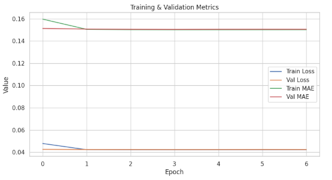

# Laporan Proyek Machine Learning - MC172D5X1392 Richelle Vania Thionanda
---
## Project Overview 

Dalam era digital saat ini, pengguna dihadapkan pada banjir informasi yang dapat menyebabkan kelelahan dalam pengambilan keputusan. Sistem rekomendasi muncul sebagai solusi penting untuk menyaring informasi dan memberikan saran yang relevan, sehingga meningkatkan pengalaman pengguna dan keterlibatan mereka. Fan *et al.* menyatakan bahwa sistem rekomendasi membantu pengguna membuat keputusan yang tepat secara efektif dan efisien dengan memberikan saran yang dipersonalisasi dalam berbagai aspek kehidupan, terutama untuk layanan online yang berorientasi pada manusia seperti platform e-commerce dan media sosial \[1].

Dalam industri hiburan, seperti layanan streaming film, sistem rekomendasi memainkan peran krusial dalam meningkatkan keterlibatan pengguna. Menurut Salunke dan Nichite, sistem rekomendasi dalam e-commerce menjadi semakin penting karena digunakan untuk mempersonalisasi pengalaman pengguna, membantu pelanggan menemukan apa yang mereka butuhkan dengan cepat dan efisien, serta meningkatkan pendapatan bisnis \[2].

Proyek ini bertujuan untuk membangun sistem rekomendasi film menggunakan dataset MovieLens 20M, yang berisi lebih dari 20 juta interaksi antara pengguna dan film. Dataset ini telah digunakan secara luas dalam penelitian sistem rekomendasi dan disediakan oleh GroupLens Research, University of Minnesota. Beel mengonfirmasi bahwa MovieLens merupakan dataset standar de facto dalam penelitian sistem rekomendasi, dengan sekitar 40% makalah di Konferensi ACM RecSys 2017 dan 2018 menggunakan variasi dataset tersebut \[3].

Untuk mengatasi tantangan dalam memberikan rekomendasi yang relevan, proyek ini mengembangkan dua pendekatan utama:

1. **Content-Based Filtering**: Menggunakan TF-IDF vectorization pada genre film dan menghitung cosine similarity antar film untuk menghasilkan rekomendasi berdasarkan kemiripan konten.

2. **Collaborative Filtering**: Menggunakan Neural Network (RecommenderNet) lebih kompleks tapi fleksibel, cocok untuk sistem yang ingin belajar interaksi non-linear dan bisa dikembangkan dengan side features (genre, usia pengguna, dll).

Dengan membandingkan performa kedua pendekatan ini, proyek ini bertujuan untuk mengevaluasi efektivitas masing-masing metode dalam konteks rekomendasi film, serta mengidentifikasi potensi kombinasi keduanya untuk meningkatkan akurasi dan relevansi rekomendasi.

---

### Referensi 

\[1] W. Fan, X. Zhao, X. Chen, J. Su, J. Gao, L. Wang, Q. Liu, Y. Wang, H. Xu, L. Chen, and Q. Li, “A comprehensive survey on trustworthy recommender systems,” *arXiv preprint*, arXiv:2209.10117, 2022. \[Online]. Available: [https://arxiv.org/abs/2209.10117](https://arxiv.org/abs/2209.10117)

\[2] T. Salunke and U. Nichite, “Recommender systems in e-commerce,” *arXiv preprint*, arXiv:2212.13910, 2022. \[Online]. Available: [https://arxiv.org/abs/2212.13910](https://arxiv.org/abs/2212.13910)

\[3] J. Beel, “On the popularity of recommender-system datasets,” *ISG Siegen Blog*, Aug. 3, 2019. \[Online]. Available: [https://isg.beel.org/blog/2019/08/03/and-the-winner-is-movielens-on-the-popularity-of-recommender-system-datasets/](https://isg.beel.org/blog/2019/08/03/and-the-winner-is-movielens-on-the-popularity-of-recommender-system-datasets/)

---

## Business Understanding

### Problem Statements

Menjelaskan pernyataan masalah:
- Bagaimana memberikan rekomendasi film yang sesuai dengan preferensi konten pengguna?
- Bagaimana memanfaatkan data historis rating pengguna untuk menemukan kesamaan preferensi antar pengguna?
- Bagaimana membandingkan performa sistem rekomendasi berbasis konten dan berbasis kolaboratif?
  
### Goals

Menjelaskan tujuan proyek yang menjawab pernyataan masalah:
- Mengembangkan sistem rekomendasi berbasis content-based filtering berdasarkan genre film.
- Mengembangkan sistem rekomendasi berbasis collaborative filtering menggunakan matrix factorization.
- Mengevaluasi dan membandingkan performa kedua pendekatan menggunakan metrik evaluasi yang relevan.

    ### Solution statements
    - Content-Based Filtering: Menggunakan TF-IDF vectorization pada genre film, dan menghitung cosine similarity antar film untuk menghasilkan rekomendasi berdasarkan kemiripan konten.
    - Collaborative Filtering: Mengembangkan sistem rekomendasi berbasis collaborative filtering menggunakan model deep learning berbasis embedding (RecommenderNet). Model ini mempelajari representasi laten pengguna dan film melalui layer embedding, memungkinkan sistem menangkap pola preferensi kompleks antar pengguna dan item.

## Data Understanding

MovieLens 20M adalah dataset populer yang digunakan untuk riset sistem rekomendasi. Dataset ini dikelola oleh GroupLens Research Project di University of Minnesota.

- Ukuran Data: Dataset ini mengandung sekitar 20 juta rating dan 465.564 aplikasi tag.
- Pengguna dan Film: Meliputi interaksi dari 138.493 pengguna pada 27.278 film.
- Periode Waktu: Data ini dibuat oleh pengguna antara 9 Januari 1995 hingga 31 Maret 2015. Dataset ini sendiri dihasilkan pada 17 Oktober 2016 (dengan pembaruan tautan dan penambahan file genome).
- Kriteria Pengguna: Setiap pengguna yang disertakan dalam dataset ini telah memberikan rating setidaknya pada 20 film, memastikan adanya riwayat interaksi yang cukup.

Dataset MovieLens 20M memiliki beberapa file, di antaranya:

**1. Informasi Film (Item/Produk)**

Dalam dataset MovieLens, file movies.csv berfungsi sebagai pusat informasi utama mengenai film. File ini berisi data seperti movieId, title, dan genres. Data ini yang menyimpan informasi inti dari setiap Genre pada film, seperti “Action”, “Comedy”, dan “Drama”.

**2. Fitur Konten Film (Konten Item)**

Untuk mendukung sistem rekomendasi berbasis konten, file tags.csv menyediakan tag-tag yang diberikan oleh pengguna pada film tertentu, misalnya “time travel” atau “mind-bending”. Dalam MovieLens, genre dari movies.csv juga dapat diperlakukan sebagai fitur konten penting.

**3. Profil Pengguna (User/Consumer)**

Dataset MovieLens 20M tidak menyediakan informasi demografis atau preferensi eksplisit pengguna. Namun, preferensi ini dapat diturunkan secara tidak langsung melalui data rating pada file ratings.csv, dengan menganalisis pola perilaku menonton pengguna.

**4. Interaksi Pengguna dan Film (User-Item-Rating)**

File ratings.csv merupakan inti dari sistem rekomendasi dalam dataset ini. File ini mencatat interaksi pengguna dengan film, dalam bentuk rating numerik dari 0.5 hingga 5.0. Data inilah yang digunakan dalam pendekatan collaborative filtering untuk memahami hubungan antar pengguna dan film berdasarkan kesamaan pola rating.

**5. Informasi Tambahan**

Selain itu, file links.csv dalam MovieLens berisi relasi antara movieId dengan ID dari basis data film lain seperti IMDb dan TMDb. File ini berguna untuk integrasi eksternal atau penambahan metadata tambahan jika dibutuhkan.

[Kaggle Dataset](https://www.kaggle.com/datasets/grouplens/movielens-20m-dataset) 

**Fitur Dataset:**
1. **`movies.csv`** – Metadata Item (Film)
File ini berisi informasi dasar tentang film yang digunakan sebagai item dalam sistem rekomendasi.
    - `movieId` (int): ID unik untuk setiap film
    - `title` (string): Judul lengkap film, termasuk tahun rilis
    - `genres` (string): Kategori genre film, dipisahkan oleh simbol `|` (contoh: `Action|Comedy|Drama`)
     File ini penting dalam pendekatan *content-based filtering* karena genre digunakan sebagai fitur konten untuk menghitung kemiripan antar film.

2. **`ratings.csv`** – User-Item Interaction (Feedback Implisit/Eksplisit)
File ini menyimpan informasi interaksi antara pengguna dan film berupa rating numerik.
    - `userId` (int): ID unik pengguna
    - `movieId` (int): ID film yang dirating
    - `rating` (float): Skor rating (0.5 – 5.0 dalam kelipatan 0.5), mencerminkan preferensi eksplisit
    - `timestamp` (int): Waktu (format UNIX epoch) saat rating diberikan
     File ini merupakan inti dari pendekatan *collaborative filtering*, yang menggunakan pola rating untuk membangun model rekomendasi.

3. **`tags.csv`** – User-Generated Content (Fitur Tambahan Item)
File ini menyimpan tag atau label deskriptif yang diberikan pengguna kepada film, menambahkan informasi semantik tambahan.
    - `userId` (int): ID pengguna
    - `movieId` (int): ID film yang diberi tag
    - `tag` (string): Kata atau frasa yang diberikan pengguna, bisa berupa genre, tema, atau nama tokoh (misal: sci-fi, based on a book, christopher nolan)
    - `timestamp` (int): Waktu tag diberikan
      Informasi dari file ini dapat digunakan untuk memperkaya fitur konten dalam content-based filtering dan untuk analisis preferensi tematik.

4. **`links.csv`** – Eksternal Identifier Mapping
File ini menyediakan koneksi antara ID film dalam MovieLens dengan ID eksternal dari basis data lain seperti IMDb dan TMDb.
    - `movieId` (int): ID film dalam MovieLens
    - `imdbId` (int): ID film dalam IMDb
    - `tmdbId (float): ID film dalam The Movie Database (TMDb); sebagian nilai dapat hilang (NaN)
      File ini berguna jika pengguna ingin menambahkan metadata tambahan dari sumber luar, seperti poster film, sinopsis, atau rating global dari situs eksternal.

- Jumlah film unik:  27278
- Jumlah pengguna unik:  138493
- Jumlah interaksi rating pengguna:  20000263
- Jumlah tag unik:  38644
- Jumlah film yang diberi tag:  19545
- Jumlah koneksi ke IMDb/TMDb:  27278

## Univariate Exploratory Data Analysis

**- Movies Variabel**
```
<class 'pandas.core.frame.DataFrame'>
RangeIndex: 27278 entries, 0 to 27277
Data columns (total 3 columns):
 #   Column   Non-Null Count  Dtype 
---  ------   --------------  ----- 
 0   movieId  27278 non-null  int64 
 1   title    27278 non-null  object
 2   genres   27278 non-null  object
dtypes: int64(1), object(2)
memory usage: 639.5+ KB
```
**- Ratings Variabel**
```
<class 'pandas.core.frame.DataFrame'>
RangeIndex: 20000263 entries, 0 to 20000262
Data columns (total 4 columns):
 #   Column     Dtype  
---  ------     -----  
 0   userId     int64  
 1   movieId    int64  
 2   rating     float64
 3   timestamp  int64  
dtypes: float64(1), int64(3)
memory usage: 610.4 MB
```
```
	userId	movieId	rating	timestamp
count	2.000026e+07	2.000026e+07	2.000026e+07	2.000026e+07
mean	6.904587e+04	9.041567e+03	3.525529e+00	1.100918e+09
std	4.003863e+04	1.978948e+04	1.051989e+00	1.621694e+08
min	1.000000e+00	1.000000e+00	5.000000e-01	7.896520e+08
25%	3.439500e+04	9.020000e+02	3.000000e+00	9.667977e+08
50%	6.914100e+04	2.167000e+03	3.500000e+00	1.103556e+09
75%	1.036370e+05	4.770000e+03	4.000000e+00	1.225642e+09
max	1.384930e+05	1.312620e+05	5.000000e+00	1.427784e+09
```
- Jumlah genre unik: 20
- Genre yang tersedia: {'Adventure', 'Thriller', 'IMAX', 'Fantasy', 'War', 'Comedy', 'Film-Noir', 'Mystery', 'Romance', 'Drama', 'Crime', 'Sci-Fi', '(no genres listed)', 'Musical', 'Horror', 'Western', 'Documentary', 'Action', 'Animation', 'Children'}
- Jumlah userID: 138493
- Jumlah movieID: 26744
- Jumlah data rating: 20000263

**- Tags Variable**
```
<class 'pandas.core.frame.DataFrame'>
RangeIndex: 465564 entries, 0 to 465563
Data columns (total 4 columns):
 #   Column     Non-Null Count   Dtype 
---  ------     --------------   ----- 
 0   userId     465564 non-null  int64 
 1   movieId    465564 non-null  int64 
 2   tag        465548 non-null  object
 3   timestamp  465564 non-null  int64 
dtypes: int64(3), object(1)
memory usage: 14.2+ MB
```
```
userId	movieId	tag	timestamp
0	18	4141	Mark Waters	1240597180
1	65	208	dark hero	1368150078
2	65	353	dark hero	1368150079
3	65	521	noir thriller	1368149983
4	65	592	dark hero	1368150078
```

**- Likns Variable**
```
<class 'pandas.core.frame.DataFrame'>
RangeIndex: 27278 entries, 0 to 27277
Data columns (total 3 columns):
 #   Column   Non-Null Count  Dtype  
---  ------   --------------  -----  
 0   movieId  27278 non-null  int64  
 1   imdbId   27278 non-null  int64  
 2   tmdbId   27026 non-null  float64
dtypes: float64(1), int64(2)
memory usage: 639.5 KB
```
### Visualisasi
- Distribusi Genre Film


Dari visualisasi, terlihat jelas bahwa "Drama" adalah genre paling dominan dengan lebih dari 13.000 film, diikuti oleh "Comedy" dan "Thriller" dengan jumlah film yang signifikan. Genre-genre lain seperti "Romance", "Action", dan "Crime" juga memiliki jumlah film yang tinggi, menunjukkan popularitasnya. Di sisi lain, genre seperti "IMAX", "Film-Noir", dan "(no genres listed)" memiliki jumlah film yang sangat sedikit, mengindikasikan bahwa ini mungkin adalah kategori yang kurang umum atau khusus dalam dataset ini.

- Distribusi Rating


Visualisasi ini menunjukkan distribusi nilai rating dalam dataset. Histogram menampilkan frekuensi kemunculan setiap nilai rating. Terlihat jelas adanya puncak-puncak yang signifikan pada rating bulat seperti 3.0, 4.0, dan 5.0, serta pada rating 0.5. Hal ini menunjukkan kecenderungan pengguna untuk memberikan rating dalam angka bulat atau setengah angka.

Selain itu, nilai rata-rata rating adalah 3.53. Ini mengindikasikan bahwa secara keseluruhan, rating yang diberikan cenderung berada di atas nilai tengah skala (misalnya, jika skala 1-5, tengahnya adalah 3), menunjukkan kecenderungan positif dalam pemberian rating film oleh pengguna.

- Distribusi Rating per Film


Dari output dan grafik, terlihat bahwa "Pulp Fiction (1994)" menduduki peringkat teratas sebagai film dengan rating terbanyak, diikuti oleh "Forrest Gump (1994)" dan "Shawshank Redemption, The (1994)". Ini menunjukkan bahwa film-film ini sangat populer dan banyak diulas oleh pengguna dalam dataset. Distribusi jumlah rating menunjukkan penurunan bertahap dari film teratas hingga film ke-20, namun semua film dalam daftar ini jelas memiliki jumlah interaksi yang sangat tinggi dari para pengguna.

- Distribusi Jumlah Rating per User


Dari hasil output dan grafik, terlihat bahwa UserID 118205 adalah pengguna paling aktif dengan lebih dari 8000 rating, diikuti oleh UserID 8405 dan UserID 82418. Kehadiran pengguna-pengguna super aktif ini sangat signifikan karena kontribusi mereka terhadap data rating sangat besar. Informasi ini dapat berguna untuk memahami pola interaksi pengguna dan mengidentifikasi "power user" yang mungkin memiliki pengaruh lebih besar pada rekomendasi atau analisis perilaku.

- Distribusi Tag


Dari visualisasi barplot, "sci-fi" adalah tag paling populer, diikuti oleh "based on a book" dan "atmospheric". Popularitas tag-tag ini memberikan gambaran tentang genre atau karakteristik film yang paling sering menjadi fokus perhatian pengguna saat memberikan tag. Keberadaan tag seperti "dark comedy" dan "psychology" juga menunjukkan kekayaan dalam deskripsi nuansa film yang diberikan oleh pengguna.

## Data Preprocessing

- Menggabungkan Data Rating dan Movie Metadata

| userId | movieId | rating | timestamp   | title                                               | genres                                      |
|--------|---------|--------|-------------|------------------------------------------------------|---------------------------------------------|
| 1      | 2       | 3.5    | 1112486027  | Jumanji (1995)                                      | Adventure\|Children\|Fantasy                |
| 1      | 29      | 3.5    | 1112484676  | City of Lost Children, The (Cité des enfants perdus) | Adventure\|Drama\|Fantasy\|Mystery\|Sci-Fi |
| 1      | 32      | 3.5    | 1112484819  | Twelve Monkeys (a.k.a. 12 Monkeys) (1995)           | Mystery\|Sci-Fi\|Thriller                   |
| 1      | 47      | 3.5    | 1112484727  | Seven (a.k.a. Se7en) (1995)                         | Mystery\|Thriller                           |
| 1      | 50      | 3.5    | 1112484580  | Usual Suspects, The (1995)                          | Crime\|Mystery\|Thriller                    |

Melakukan penggabungan data rating film dengan informasi film (judul dan genre) menggunakan fungsi pd.merge di Python. Hasil penggabungan ini menghasilkan sebuah DataFrame baru bernama movie_ratings yang berisi kolom userId, movieId, rating, timestamp, title, dan genres. Hal ini memungkinkan kita untuk melihat rating yang diberikan oleh setiap pengguna pada film-film tertentu, lengkap dengan judul dan genre film tersebut.

DataFrame movie_ratings yang ditampilkan menunjukkan beberapa baris pertama dari data yang telah digabungkan. Sebagai contoh, pengguna dengan userId 1 memberikan rating 3.5 untuk film "Jumanji (1995)" yang bergenre "Adventure|Children|Fantasy". Penggabungan data ini merupakan langkah penting dalam analisis data film karena menyatukan informasi dari berbagai sumber, sehingga memudahkan untuk mendapatkan wawasan tentang preferensi pengguna, popularitas film berdasarkan rating, atau bahkan untuk membangun sistem rekomendasi.

- Memeriksa Missing Values

Berikut adalah jumlah nilai yang hilang (missing values) pada setiap kolom dalam dataset:

| Column     | Missing Values |
|------------|----------------|
| userId     | 0              |
| movieId    | 0              |
| rating     | 0              |
| timestamp  | 0              |
| title      | 0              |
| genres     | 0              |


Ini adalah hasil yang sangat baik dalam tahap pra-pemrosesan data, karena ketiadaan missing value berarti data sudah bersih dan tidak memerlukan penanganan khusus seperti imputasi atau penghapusan baris/kolom yang berisi missing value. Hal ini memastikan bahwa analisis atau pemodelan data yang akan dilakukan selanjutnya dapat berjalan tanpa hambatan yang disebabkan oleh data yang tidak lengkap, sehingga menghasilkan analisis yang lebih akurat dan dapat diandalkan.

- Menggabungkan Tags

| userId | movieId | rating | timestamp   | title                                               | genres                                  | tag  |
|--------|---------|--------|-------------|------------------------------------------------------|------------------------------------------|------|
| 1      | 2       | 3.5    | 1112486027  | Jumanji (1995)                                       | Adventure\|Children\|Fantasy             | NaN  |
| 1      | 29      | 3.5    | 1112484676  | City of Lost Children, The (Cité des enfants perdus) | Adventure\|Drama\|Fantasy\|Mystery\|Sci-Fi | NaN  |
| 1      | 32      | 3.5    | 1112484819  | Twelve Monkeys (a.k.a. 12 Monkeys) (1995)            | Mystery\|Sci-Fi\|Thriller                | NaN  |
| 1      | 47      | 3.5    | 1112484727  | Seven (a.k.a. Se7en) (1995)                          | Mystery\|Thriller                        | NaN  |
| 1      | 50      | 3.5    | 1112484580  | Usual Suspects, The (1995)                           | Crime\|Mystery\|Thriller                 | NaN  |


Operasi penggabungan (merge) telah dilakukan antara dataframe movie_ratings dan tags. Tujuan dari penggabungan ini adalah untuk menambahkan informasi tag ke dalam data rating film. Namun, dari output movie_ratings_tags.head() yang ditampilkan, kolom 'tag' hanya berisi nilai NaN (Not a Number) untuk semua baris yang terlihat.

Ini mengindikasikan bahwa meskipun penggabungan dilakukan berdasarkan 'userId' dan 'movieId', tidak ada kecocokan tag yang ditemukan untuk entri-entri film awal dalam dataframe movie_ratings. Kemungkinan penyebabnya adalah data tags mungkin tidak memiliki tag yang sesuai untuk film-film ini, atau mungkin ada ketidaksesuaian dalam data 'userId' atau 'movieId' antara kedua dataframe, meskipun hal ini kurang mungkin terjadi jika penggabungan dilakukan dengan benar. Untuk mendapatkan insight yang lebih lengkap, perlu diperiksa lebih lanjut isi dari dataframe tags dan bagaimana distribusi tag yang sebenarnya.

- Final Data

| userId | movieId | title                                               | genres                                      | rating | tag  |
|--------|---------|------------------------------------------------------|---------------------------------------------|--------|------|
| 1      | 2       | Jumanji (1995)                                       | Adventure\|Children\|Fantasy                | 3.5    | NaN  |
| 1      | 29      | City of Lost Children, The (Cité des enfants perdus) | Adventure\|Drama\|Fantasy\|Mystery\|Sci-Fi | 3.5    | NaN  |
| 1      | 32      | Twelve Monkeys (a.k.a. 12 Monkeys) (1995)            | Mystery\|Sci-Fi\|Thriller                   | 3.5    | NaN  |
| 1      | 47      | Seven (a.k.a. Se7en) (1995)                          | Mystery\|Thriller                           | 3.5    | NaN  |
| 1      | 50      | Usual Suspects, The (1995)                           | Crime\|Mystery\|Thriller                    | 3.5    | NaN  |

Dataframe baru bernama final_data telah dibuat dengan memilih kolom-kolom tertentu dari dataframe movie_ratings_tags yang telah ada sebelumnya. Kolom-kolom yang dipilih adalah 'userId', 'movieId', 'title', 'genres', 'rating', dan 'tag'.

Output final_data.head() menunjukkan lima baris pertama dari dataframe yang dihasilkan. Seperti yang telah diamati pada analisis sebelumnya, kolom 'tag' masih menunjukkan nilai NaN (Not a Number) untuk semua baris yang ditampilkan. Hal ini mengkonfirmasi bahwa proses pemilihan kolom tidak mengubah fakta bahwa tidak ada data tag yang cocok untuk film-film awal ini dalam dataframe movie_ratings_tags yang menjadi sumbernya. Dengan kata lain, final_data saat ini masih belum memiliki informasi tag yang lengkap untuk film-film tersebut, sehingga kolom 'tag' belum memberikan nilai tambah dalam analisis ini.


## Data Preparation
- Cek Missing Values

| Kolom   | Jumlah Missing Values |
|---------|------------------------|
| userId  | 0                      |
| movieId | 0                      |
| title   | 0                      |
| genres  | 0                      |
| rating  | 0                      |
| tag     | 19,874,181             |

Hampir semua kolom (userId, movieId, title, genres, rating) tidak memiliki nilai yang hilang, yang berarti data pada kolom-kolom ini sudah lengkap. Namun, kolom tag memiliki jumlah nilai yang hilang yang sangat besar, yaitu 19.874.181. Ini mengkonfirmasi pengamatan sebelumnya bahwa kolom 'tag' mayoritas berisi NaN setelah operasi penggabungan. Jumlah nilai hilang yang sangat signifikan ini menunjukkan bahwa informasi tag tidak tersedia untuk sebagian besar entri film dan rating dalam dataset gabungan. Hal ini bisa menjadi masalah serius jika analisis atau model yang akan dibangun sangat bergantung pada informasi tag. Langkah selanjutnya mungkin perlu mempertimbangkan strategi untuk menangani nilai yang hilang pada kolom 'tag', seperti mengisi dengan nilai tertentu (misalnya, 'no_tag' atau 'unknown'), menghapus baris yang memiliki nilai hilang pada kolom tag (jika jumlahnya tidak terlalu besar dan tidak signifikan), atau melakukan analisis terpisah untuk entri yang memiliki tag dan yang tidak.

- Membersihkan Missing Value

**5 Baris Awal**

| userId | movieId | title                                               | genres                             | rating | tag         |
|--------|---------|------------------------------------------------------|------------------------------------|--------|-------------|
| 65     | 27866   | In My Father's Den (2004)                            | Drama                              | 4.0    | New Zealand |
| 65     | 48082   | Science of Sleep, The (La science des rêves) (...)   | Comedy\|Drama\|Fantasy\|Romance    | 4.5    | surreal     |
| 65     | 48082   | Science of Sleep, The (La science des rêves) (...)   | Comedy\|Drama\|Fantasy\|Romance    | 4.5    | unusual     |
| 65     | 58652   | CJ7 (Cheung Gong 7 hou) (2008)                        | Children\|Comedy\|Sci-Fi           | 5.0    | cute        |
| 65     | 58652   | CJ7 (Cheung Gong 7 hou) (2008)                        | Children\|Comedy\|Sci-Fi           | 5.0    | emotional   |

**5 Baris Akhir**

| userId  | movieId | title                                           | genres                        | rating | tag            |
|---------|---------|--------------------------------------------------|-------------------------------|--------|----------------|
| 138446  | 55999   | Mr. Magorium's Wonder Emporium (2007)           | Children\|Comedy\|Fantasy     | 2.5    | dragged        |
| 138446  | 55999   | Mr. Magorium's Wonder Emporium (2007)           | Children\|Comedy\|Fantasy     | 2.5    | Jason Bateman  |
| 138446  | 55999   | Mr. Magorium's Wonder Emporium (2007)           | Children\|Comedy\|Fantasy     | 2.5    | quirky         |
| 138446  | 55999   | Mr. Magorium's Wonder Emporium (2007)           | Children\|Comedy\|Fantasy     | 2.5    | sad            |
| 138472  | 923     | Citizen Kane (1941)                              | Drama\|Mystery                | 3.0    | rise to power  |

391444 rows × 6 columns

Dengan menghapus baris yang memiliki nilai NaN pada kolom 'tag', dataset sekarang lebih bersih dan siap untuk analisis yang membutuhkan informasi tag. Namun, perlu diingat bahwa ini juga berarti data yang tersisa mungkin tidak lagi merepresentasikan keseluruhan dataset awal, karena sebagian besar data telah dibuang. Analisis selanjutnya hanya akan berlaku untuk subset data yang memiliki tag. Hal ini penting untuk dipertimbangkan agar tidak menarik kesimpulan yang salah mengenai keseluruhan perilaku pengguna atau popularitas film jika hanya menggunakan data ini.

- Cek dan Bersihkan Duplikat
```
Jumlah data duplikat: 0
```
Dengan tidak adanya duplikat, analisis atau model yang akan dibangun di kemudian hari akan beroperasi pada dataset yang bersih dan setiap pengamatan (baris) akan merepresentasikan informasi yang berbeda. Ini sangat penting untuk memastikan keakuratan hasil dan menghindari perhitungan berulang yang tidak perlu.

### Preparation untuk Content Based Filtering

* **TF-IDF Vectorization**
```
# Ambil sampel 5000 film
data = data.sample(n=5000, random_state=42).reset_index(drop=True)

# Ambil movieIds yang ada di subset data yang sudah disampling
sampled_movie_ids = data['movieId'].unique()

# Filter DataFrame movies agar hanya berisi film-film ini
movies = movies[movies['movieId'].isin(sampled_movie_ids)]

# Opsional: Reset index jika diperlukan untuk operasi selanjutnya
movies = movies.reset_index(drop=True)
```

Kode ini melakukan **penyaringan dan pengambilan sampel data film** dari dataset besar untuk mempersiapkan proses **TF-IDF Vectorization** berdasarkan kolom `genres`.

  1. **Sampling acak 5000 film** dari dataset `data` untuk memperkecil beban komputasi pada proses vektorisasi. Penggunaan `random_state=42` menjamin hasil sampling tetap konsisten (reproducible).

  2. Menyimpan daftar `movieId` dari sampel film yang telah diambil — akan digunakan untuk menyaring DataFrame `movies`.

  3. Memastikan DataFrame `movies` hanya berisi **film-film yang termasuk dalam sampel**. Ini penting agar TF-IDF dilakukan hanya pada subset data yang relevan.

  4. Mereset indeks DataFrame `movies` agar rapi dan siap digunakan untuk proses vektorisasi atau manipulasi lanjutan.

* ** Pembersihan kolom genres **

```
# Bersihkan data genre
movies['genres'] = movies['genres'].replace('(no genres listed)', '', regex=False).str.replace('|', ' ', regex=False)

# Inisialisasi TF-IDF Vectorizer
tfv = TfidfVectorizer()

# Fit TF-IDF ke genre
tfv.fit(movies['genres'])

# Lihat fitur genre
tfv.get_feature_names_out()

```

Output:

```
array(['action', 'adventure', 'animation', 'children', 'comedy', 'crime',
       'documentary', 'drama', 'fantasy', 'fi', 'film', 'horror', 'imax',
       'musical', 'mystery', 'noir', 'romance', 'sci', 'thriller', 'war',
       'western'], dtype=object)
```
1. Pembersihan Data Genre: Baris kode pertama movies['genres'] = movies['genres'].replace('(no genres listed)', '', regex=False).str.replace('|', ',', regex=False) bertujuan untuk membersihkan data pada kolom 'genres'.
  - replace('(no genres listed)', '', regex=False): Ini mengganti string "(no genres listed)" dengan string kosong. Hal ini penting karena "(no genres listed)" adalah placeholder yang tidak relevan untuk analisis konten dan dapat mengganggu proses vectorization.
  - str.replace('|', ',', regex=False): Ini mengganti karakter | (yang biasa digunakan untuk memisahkan genre) dengan koma ,. Tujuan dari penggantian ini kemungkinan untuk memformat ulang string genre agar lebih mudah diurai atau diproses oleh TfidfVectorizer, meskipun TfidfVectorizer biasanya dapat menangani string dengan spasi sebagai pemisah default. Jika ini bertujuan untuk menggabungkan genre yang dipisahkan oleh | menjadi satu string dengan pemisah koma, maka ini akan menciptakan "token" yang berbeda untuk setiap genre yang dipisahkan oleh koma.

2. Inisialisasi dan Fitting TF-IDF Vectorizer:
  - tfv = TfidfVectorizer(): Sebuah objek TfidfVectorizer diinisialisasi. TF-IDF (Term Frequency-Inverse Document Frequency) adalah teknik yang digunakan untuk mengubah teks menjadi representasi numerik, di mana setiap kata atau "term" diberi bobot berdasarkan seberapa sering muncul dalam dokumen (film) dan seberapa unik kata tersebut di seluruh korpus (semua film).
  - tfv.fit(movies['genres']): Vectorizer ini kemudian "dilatih" (fitted) pada kolom 'genres' dari dataframe movies. Proses fit ini mempelajari semua genre unik (atau "term") yang ada di seluruh dataset dan membangun kosakata internalnya.

3. Ekstraksi Fitur Genre:
  - tfv.get_feature_names_out(): Setelah fit, fungsi ini dipanggil untuk melihat daftar fitur (yaitu, genre unik) yang telah dipelajari oleh TfidfVectorizer. Outputnya adalah array yang berisi semua genre yang terdeteksi, seperti 'action', 'adventure', 'animation', 'children', 'comedy', dll.

Secara keseluruhan, langkah-langkah ini menyiapkan data genre untuk diubah menjadi format numerik yang dapat digunakan oleh model Content Based Filtering. TF-IDF akan memberikan bobot pada setiap genre untuk setiap film, mencerminkan seberapa penting genre tersebut bagi film tertentu dalam konteks seluruh koleksi film. Ini adalah langkah krusial dalam membangun representasi konten film.

Output setelah mengubah representasi fitur teks menjadi matriks numerik

| Title                                         | imax     | noir | drama   | horror  | children |
|----------------------------------------------|----------|------|---------|---------|----------|
| Harry Potter and the Half-Blood Prince (2009)| 0.569092 | 0.0  | 0.000000| 0.000000| 0.0      |
| Harlan County U.S.A. (1976)                  | 0.000000 | 0.0  | 0.000000| 0.000000| 0.0      |
| Man on Fire (2004)                           | 0.000000 | 0.0  | 0.287479| 0.000000| 0.0      |
| Annie Hall (1977)                            | 0.000000 | 0.0  | 0.000000| 0.000000| 0.0      |
| Paprika (Papurika) (2006)                    | 0.000000 | 0.0  | 0.000000| 0.000000| 0.0      |
| Velvet Goldmine (1998)                       | 0.000000 | 0.0  | 1.000000| 0.000000| 0.0      |
| Halloween III: Season of the Witch (1982)    | 0.000000 | 0.0  | 0.000000| 1.000000| 0.0      |
| Blair Witch Project, The (1999)              | 0.000000 | 0.0  | 0.388570| 0.745128| 0.0      |
| Alamo, The (1960)                            | 0.000000 | 0.0  | 0.238976| 0.000000| 0.0      |
| Pay It Forward (2000)                        | 0.000000 | 0.0  | 1.000000| 0.000000| 0.0      |


Output ini menujukkan bahwa berhasil mengubah data tekstual (genre/fitur) menjadi representasi numerik yang terstruktur dan siap digunakan untuk analisis lebih lanjut dalam pengembangan model rekomendasi berbasis konten. Output tabel dengan skor TF-IDF per film dan per fitur adalah langkah penting dalam membangun matriks kesamaan item atau profil pengguna.

* **Cosine Similarity**

Output matriks similiarity:

Shape: (2500, 2500)

| Title                                           | Zero Effect (1998) | Badlands (1973) | Far Side of the Moon, The (2003) | Face cachée de la lune, La (2003) | Muppet Movie, The (1979) | Quantum of Solace (2008) |
|------------------------------------------------|---------------------|------------------|-----------------------------------|------------------------------------|----------------------------|---------------------------|
| Witness for the Prosecution (1957)             | 0.830105            | 0.455965         | 0.370868                          | 0.000000                           | 0.000000                   | 0.284065                  |
| Shoot the Piano Player (Tirez sur le pianiste) | 0.243072            | 0.834683         | 0.343564                          | 0.000000                           | 0.000000                   | 0.259615                  |
| D.C.H. (Dil Chahta Hai) (2001)                 | 0.343381            | 0.280674         | 0.633302                          | 0.000000                           | 0.239678                   | 0.000000                  |
| Little Giants (1994)                           | 0.210789            | 0.000000         | 0.000000                          | 0.000000                           | 0.652875                   | 0.000000                  |
| Full Metal Jacket (1987)                       | 0.000000            | 0.164516         | 0.396888                          | 0.000000                           | 0.000000                   | 0.000000                  |
| Aileen: Life and Death of a Serial Killer (2003)| 0.000000           | 0.000000         | 0.000000                          | 0.000000                           | 0.000000                   | 0.000000                  |
| X-Men: First Class (2011)                      | 0.167117            | 0.191865         | 0.000000                          | 0.000000                           | 0.156893                   | 0.084979                  |
| Robin Hood: Men in Tights (1993)               | 0.444320            | 0.000000         | 0.000000                          | 0.000000                           | 0.309700                   | 0.000000                  |
| First Snow (2006)                               | 0.412214            | 0.706487         | 0.582833                          | 0.000000                           | 0.000000                   | 0.440098                  |
| Superman (1978)                                 | 0.000000            | 0.000000         | 0.000000                          | 0.000000                           | 0.202833                   | 0.568143                  |


* **Tujuan:** Kode ini melanjutkan proses pembuatan matriks kemiripan antar film dengan mengubah matriks `cosine_sim` (yang sebelumnya dihasilkan sebagai array NumPy) menjadi Pandas DataFrame. Tujuannya adalah untuk memberikan indeks dan nama kolom yang lebih mudah dibaca (yaitu, judul film), sehingga mempermudah analisis dan penggunaan matriks kemiripan ini.
* **Transformasi menjadi DataFrame:**
    * `cosine_sim_df = pd.DataFrame(cosine_sim, ...)`: Matriks `cosine_sim` diubah menjadi DataFrame.
    * `index=movies['title']`: Setiap baris DataFrame diberi indeks berupa judul film. Ini sangat membantu untuk mencari kemiripan film tertentu.
    * `columns=movies['title']`: Setiap kolom DataFrame diberi nama berupa judul film. Ini membuat matriks kemiripan sangat intuitif untuk dibaca, karena Anda bisa langsung melihat kemiripan antara dua film berdasarkan judulnya.
* **Pengecekan Ukuran:** `print('Shape: ', cosine_sim_df.shape)` kembali mengkonfirmasi bahwa DataFrame memiliki ukuran `(2500, 2500)`, sesuai dengan jumlah film yang ada.
* **Sampling Tampilan:** `cosine_sim_df.sample(10, axis=0).sample(5, axis=1)` adalah cara cerdas untuk melihat sebagian kecil dari matriks kemiripan yang besar.
    * `sample(10, axis=0)`: Mengambil 10 baris (film) acak.
    * `sample(5, axis=1)`: Kemudian, dari 10 baris tersebut, hanya menampilkan 5 kolom (film) acak. Ini sangat berguna untuk mendapatkan gambaran sekilas tanpa harus melihat seluruh matriks 2500x2500.


1.  **Kemudahan Interpretasi:** Tabel yang ditampilkan adalah sampel dari matriks kemiripan. Setiap sel menunjukkan skor kemiripan (cosine similarity) antara film pada indeks baris dengan film pada nama kolom.
    * **Contoh:** Untuk film "Glimmer Man, The (1996)", kemiripannya dengan "Three Musketeers, The (1973)" adalah 0.415790, dan dengan "Source Code (2011)" adalah 0.514665.
2.  **Nilai Nol (0.000000):** Banyak sel yang bernilai 0.000000. Ini berarti tidak ada kemiripan konten yang terdeteksi antara dua film tersebut berdasarkan fitur TF-IDF yang digunakan. Ini bisa terjadi karena:
    * Film-film tersebut tidak memiliki genre atau tag yang sama.
    * Vektor TF-IDF mereka saling tegak lurus (tidak ada kesamaan).
3.  **Variasi Skor Kemiripan:** Skor kemiripan bervariasi dari 0 hingga sekitar 0.73 (seperti antara "Starship Troopers (1997)" dan "Source Code (2011)"). Skor yang lebih tinggi menunjukkan kesamaan konten yang lebih besar.
4.  **Basis Rekomendasi yang Jelas:** DataFrame ini secara langsung menjadi alat utama untuk merekomendasikan film. Jika seorang pengguna menyukai "Source Code (2011)", kita dapat mencari kolom "Source Code (2011)" dan mengurutkan film-film lain berdasarkan skor kemiripan tertinggi untuk merekomendasikan film serupa.

**Kesimpulan:**

Langkah ini berhasil mengorganisir hasil perhitungan cosine similarity ke dalam format DataFrame yang sangat mudah digunakan dan diinterpretasikan. Dengan indeks dan kolom yang berisi judul film, matriks ini siap digunakan sebagai inti dari mesin rekomendasi berbasis konten. Ini memungkinkan identifikasi cepat film-film yang memiliki kemiripan konten tinggi, yang merupakan dasar untuk memberikan rekomendasi yang relevan kepada pengguna.

### Preparation untuk Collaborative Filtering
- **Encode userid** bertujuan untuk melakukan encoding pada userId yang ada di DataFrame. Artinya, setiap userId unik akan dipetakan ke dalam bentuk integer berurutan (misalnya, dari 0 hingga N-1, di mana N adalah jumlah pengguna unik). Ini adalah langkah umum dalam sistem rekomendasi, terutama ketika mempersiapkan data untuk model yang memerlukan input numerik atau ketika bekerja dengan ID yang tidak berurutan.
- **Encode movieId** bertujuan untuk melakukan encoding pada movieId yang ada di DataFrame, mirip dengan proses encoding userId yang telah dilakukan sebelumnya. Setiap movieId unik akan dipetakan ke dalam bentuk integer berurutan (misalnya, dari 0 hingga M-1, di mana M adalah jumlah film unik).
- **Float & Statistik** memastikan konsistensi tipe data dan memberikan gambaran menyeluruh tentang ukuran dataset (jumlah pengguna dan film) serta karakteristik data rating. Informasi ini krusial untuk:
	- Merencanakan arsitektur model (misalnya, ukuran embedding layer untuk model neural network).
	- Memilih algoritma rekomendasi yang sesuai (beberapa algoritma lebih cocok untuk dataset besar).
	- Menentukan metrik evaluasi yang relevan.
	- Memastikan data dalam format yang benar untuk langkah pelatihan model selanjutnya.
 - **Membagi Data untuk Training dan Validasi** untuk memastikan kualitas dan keandalan model machine learning yang akan dibangun. Pengacakan data yang dilakukan dengan df.sample(frac=1, random_state=42) adalah praktik terbaik untuk menyiapkan data sebelum pembagian menjadi set pelatihan dan validasi, terutama untuk dataset yang sangat besar seperti ini. Mendefinisikan fitur (x) dan label (y), serta melakukan pembagian data menjadi set pelatihan (train) dan validasi (val). Selain itu, nilai rating dinormalisasi.
 - **Format Input** sistem menyiapkan data yang dibutuhkan untuk menghasilkan rekomendasi film bagi seorang pengguna dengan pendekatan Collaborative Filtering. Proses dimulai dengan memilih salah satu pengguna secara acak, lalu sistem mengidentifikasi film-film yang belum pernah ditonton oleh pengguna tersebut.

## Modeling
### Model Development Content Based Filtering
#### Fungsi Rekomendasi
```
def movie_recommendations(judul_film, similarity_data=cosine_sim_df, items=movies[['title', 'genres']], k=5):
    """
    Memberikan rekomendasi film berdasarkan kemiripan konten (genre)
    """
    # Ambil index dengan similarity tertinggi
    index = similarity_data.loc[:, judul_film].to_numpy().argpartition(range(-1, -k, -1))

    # Ambil nama-nama film yang paling mirip
    closest = similarity_data.columns[index[-1:-(k+2):-1]]

    # Drop judul film input agar tidak direkomendasikan ke dirinya sendiri
    closest = closest.drop(judul_film, errors='ignore')

    # Ubah menjadi DataFrame dan beri nama kolom 'title'
    closest_df = pd.DataFrame(closest, columns=['title'])

    # Merge dengan metadata (judul + genre)
    return closest_df.merge(items, on='title').head(k)
```
Fungsi movie_recommendations() merekomendasikan film berdasarkan kemiripan genre menggunakan cosine similarity dari matriks TF-IDF.
- Mencari film yang paling mirip dengan film acuan (judul_film)
- Menghindari merekomendasikan film itu sendiri
- Mengembalikan k film terdekat beserta judul dan genre-nya
Efisien karena memakai argpartition untuk pencarian cepat dan langsung menggabungkan hasil dengan metadata film.

#### Penggunaan Rekomendasi
**Output Detail Film**

|     | movieId | Title                                        | Genres                                                       |
|-----|---------|----------------------------------------------|--------------------------------------------------------------|
| 0   | 5218    | Ice Age (2002)                               | Adventure Animation Children Comedy                          |
| 1   | 44022   | Ice Age 2: The Meltdown (2006)               | Adventure Animation Children Comedy                          |
| 2   | 69644   | Ice Age: Dawn of the Dinosaurs (2009)        | Action Adventure Animation Children Comedy Romance Sci-Fi    |


Memfilter dataset film (movies) guna menampilkan detail film yang mengandung kata "Ice Age" di dalam judulnya, tanpa membedakan huruf besar atau kecil (case=False). Hasil dari filtering ini adalah sebuah tabel yang menunjukkan tiga film dalam franchise "Ice Age": "Ice Age (2002)", "Ice Age 2: The Meltdown (2006)", dan "Ice Age: Dawn of the Dinosaurs (2009)". Untuk setiap film, ditampilkan movieId, title, dan genres yang terkait, menunjukkan bahwa ketiga film tersebut memiliki genre dasar "Adventure", "Animation", dan "Children Comedy", dengan "Ice Age: Dawn of the Dinosaurs" juga memiliki genre "Action" dan "Romance".

**Output Rekomendasi Film**

|    | Title                                                           | Genres                                |
|----|-----------------------------------------------------------------|----------------------------------------|
| 0  | Horton Hears a Who! (2008)                                      | Adventure Animation Children Comedy    |
| 1  | Wallace & Gromit in The Curse of the Were-Rabbit (2005)         | Adventure Animation Children Comedy    |
| 2  | Over the Hedge (2006)                                           | Adventure Animation Children Comedy    |
| 3  | Ice Age 2: The Meltdown (2006)                                  | Adventure Animation Children Comedy    |
| 4  | Rio (2011)                                                      | Adventure Animation Children Comedy    |
| 5  | Curious George (2006)                                           | Adventure Animation Children Comedy    |
| 6  | Finding Nemo (2003)                                             | Adventure Animation Children Comedy    |
| 7  | Bug's Life, A (1998)                                            | Adventure Animation Children Comedy    |
| 8  | Madagascar (2005)                                               | Adventure Animation Children Comedy    |
| 9  | 101 Dalmatians (One Hundred and One Dalmatians) (1961)          | Adventure Animation Children           |

Model rekomendasi berhasil mengidentifikasi 10 film teratas yang memiliki kemiripan dengan "Ice Age (2002)". Dari daftar tersebut, terlihat bahwa rekomendasi didominasi oleh film-film dengan genre yang serupa, yaitu Adventure, Animation, Children, dan Comedy. Ini menunjukkan bahwa sistem rekomendasi bekerja dengan baik dalam menemukan item yang memiliki karakteristik genre yang sama.

**Analisis Rekomendasi:**

1. Konsistensi Genre: Hampir semua film yang direkomendasikan memiliki kombinasi genre yang sama dengan "Ice Age (2002)", yang merupakan film petualangan animasi untuk anak-anak dengan sentuhan komedi. Ini mengindikasikan bahwa model cenderung merekomendasikan film-film dalam kategori yang familiar bagi penggemar film tersebut.
2. Kehadiran Sekuel: "Ice Age 2: The Meltdown (2006)" muncul di posisi keempat. Kehadiran sekuel dalam daftar rekomendasi adalah hal yang sangat wajar dan diinginkan dalam sistem rekomendasi karena penggemar film pertama seringkali tertarik pada kelanjutan ceritanya. Ini menunjukkan kemampuan model untuk mengidentifikasi hubungan antar-film yang kuat.
3. Film Animasi Populer Lainnya: Daftar ini juga mencakup film-film animasi populer dari berbagai studio seperti "Horton Hears a Who! (2008)", "Finding Nemo (2003)", "Rio (2011)", "Madagascar (2005)", dan "Over the Hedge (2006)". Ini menunjukkan bahwa model mampu menangkap preferensi umum terhadap film animasi berkualitas tinggi dalam genre yang sama.
4. Variasi Tahun Rilis: Rekomendasi mencakup film-film dari berbagai tahun rilis (misalnya, 1998 hingga 2011), yang menunjukkan bahwa model tidak hanya terpaku pada film-film terbaru atau tertua, melainkan mencari kemiripan berdasarkan fitur-fitur yang lebih substansial.

Secara keseluruhan, hasil rekomendasi ini menunjukkan bahwa model bekerja secara efektif dalam mengidentifikasi film-film yang relevan dan menarik bagi penonton "Ice Age (2002)" berdasarkan kemiripan genre dan kemungkinan preferensi umum terhadap film animasi anak-anak yang bersifat petualangan dan komedi.

### Model Development dengan Collaborative Filtering
#### Membangun Model Collaborative Filtering
```
class RecommenderNet(tf.keras.Model):
    def __init__(self, num_users, num_movies, embedding_size=50, **kwargs):
        super(RecommenderNet, self).__init__(**kwargs)
        self.user_embedding = layers.Embedding(
            input_dim=num_users,
            output_dim=embedding_size,
            embeddings_initializer="he_normal",
            embeddings_regularizer=keras.regularizers.l2(1e-6)
        )
        self.user_bias = layers.Embedding(input_dim=num_users, output_dim=1)

        self.movie_embedding = layers.Embedding(
            input_dim=num_movies,
            output_dim=embedding_size,
            embeddings_initializer="he_normal",
            embeddings_regularizer=keras.regularizers.l2(1e-6)
        )
        self.movie_bias = layers.Embedding(input_dim=num_movies, output_dim=1)

    def call(self, inputs):
        user_id = inputs[:, 0]
        movie_id = inputs[:, 1]

        user_vector = self.user_embedding(user_id)
        user_bias = self.user_bias(user_id)

        movie_vector = self.movie_embedding(movie_id)
        movie_bias = self.movie_bias(movie_id)

        dot_product = tf.reduce_sum(user_vector * movie_vector, axis=1, keepdims=True)

        # Add bias terms
        x = dot_product + user_bias + movie_bias

        # Optional activation (sigmoid output between 0–1 if predicting rating between those)
        return x
```

**1. Struktur Model (Class `RecommenderNet`)**

Model ini diimplementasikan sebagai subclass dari `tf.keras.Model`, menunjukkan bahwa ini adalah model Deep Learning.

* **Jenis dan Jumlah Layer:**
    * **Layer Embedding untuk Pengguna:**
        * `self.user_embedding = layers.Embedding(...)`: Ini adalah layer utama untuk merepresentasikan setiap pengguna sebagai sebuah vektor dense (embedding).
        * `self.user_bias = layers.Embedding(...)`: Layer ini merepresentasikan bias unik untuk setiap pengguna. Bias ini menangkap kecenderungan umum pengguna untuk memberikan rating tinggi atau rendah, terlepas dari item spesifik.
    * **Layer Embedding untuk Film (Item):**
        * `self.movie_embedding = layers.Embedding(...)`: Mirip dengan embedding pengguna, layer ini merepresentasikan setiap film sebagai sebuah vektor dense.
        * `self.movie_bias = layers.Embedding(...)`: Layer ini merepresentasikan bias unik untuk setiap film, menangkap popularitas umum film atau kecenderungannya untuk menerima rating tinggi/rendah.

* **Ukuran Embedding (`embedding_size=50`):**
    * Setiap pengguna dan setiap film akan direpresentasikan oleh sebuah vektor berdimensi 50. Ukuran ini adalah *hyperparameter* penting. Semakin besar ukuran embedding, semakin banyak informasi yang dapat ditangkap oleh vektor tersebut, tetapi juga meningkatkan kompleksitas model dan risiko *overfitting*.

* **Inisialisasi Embedding (`embeddings_initializer="he_normal"`):**
    * Menggunakan inisialisasi "He Normal" (atau kadang disebut "Kaiming Normal"). Ini adalah teknik inisialisasi bobot yang populer, terutama untuk layer dengan fungsi aktivasi ReLU (meskipun tidak ada ReLU eksplisit di sini, ini adalah praktik umum). Tujuannya adalah untuk menjaga skala varians aktivasi tetap stabil selama pelatihan.

* **Regularisasi Embedding (`embeddings_regularizer=keras.regularizers.l2(1e-6)`):**
    * Menggunakan regularisasi L2 (juga dikenal sebagai *weight decay*) dengan kekuatan $1e-6$. Regularisasi L2 menambahkan penalti pada ukuran bobot embedding. Ini membantu mencegah *overfitting* dengan mendorong bobot embedding untuk tetap kecil dan mencegah model terlalu bergantung pada fitur-fitur spesifik dalam data pelatihan.

**2. Mekanisme Kerja Model (`call` method)**

Metode `call` mendefinisikan bagaimana input diproses oleh model untuk menghasilkan output prediksi.

* **Input:** Model menerima dua input: `user_id` dan `movie_id`. Ini menunjukkan bahwa model memprediksi interaksi (misalnya, rating) berdasarkan pasangan pengguna-film.
* **Lookup Embedding:**
    * `user_vector = self.user_embedding(user_id)`: Mengambil vektor embedding untuk `user_id` yang diberikan.
    * `user_bias = self.user_bias(user_id)`: Mengambil bias untuk `user_id`.
    * `movie_vector = self.movie_embedding(movie_id)`: Mengambil vektor embedding untuk `movie_id` yang diberikan.
    * `movie_bias = self.movie_bias(movie_id)`: Mengambil bias untuk `movie_id`.
* **Perhitungan Dot Product:**
    * `dot_product = tf.reduce_sum(user_vector * movie_vector, axis=1, keepdims=True)`: Ini adalah inti dari Collaborative Filtering berbasis Matrix Factorization. Prediksi dasar dihasilkan dari *dot product* (perkalian skalar) antara vektor embedding pengguna dan vektor embedding film. Dot product mengukur "kesamaan" antara pengguna dan film dalam ruang embedding. Semakin mirip mereka, semakin tinggi dot product-nya, yang mengindikasikan kemungkinan preferensi yang lebih tinggi.
* **Penambahan Bias:**
    * `x = dot_product + user_bias + movie_bias`: Bias pengguna dan bias film ditambahkan ke dot product. Ini penting karena:
        * **Bias Pengguna:** Menyesuaikan prediksi berdasarkan kecenderungan umum pengguna (misalnya, pengguna yang selalu memberikan rating tinggi).
        * **Bias Film:** Menyesuaikan prediksi berdasarkan popularitas atau kualitas umum film (misalnya, film yang selalu mendapatkan rating tinggi).
* **Fungsi Aktivasi (Opsional):**
    * `# Optional activation (sigmoid output between 0-1 if predicting rating between those)`: Komentar ini sangat penting. Jika model ini digunakan untuk memprediksi rating diskrit (misalnya, skala 1-5), maka tidak diperlukan fungsi aktivasi di lapisan output. Namun, jika tujuannya adalah memprediksi probabilitas atau nilai dalam rentang tertentu (misalnya, 0-1), fungsi aktivasi seperti `sigmoid` akan sangat berguna untuk membatasi output dalam rentang tersebut. Tanpa fungsi aktivasi, output `x` bisa berupa nilai real apa saja.

**3. Parameter Pelatihan (Tidak Terlihat Langsung dalam Kode Ini, Tetapi Penting untuk Penjelasan Anda):**

Meskipun kode yang diberikan hanya menampilkan struktur model, untuk menjelaskan model secara lengkap, Anda harus menyertakan informasi berikut saat menyajikannya kepada pembaca:

* **Fungsi Loss (Loss Function):**
    * Untuk tugas prediksi rating, *Mean Squared Error* (MSE) adalah pilihan umum (`tf.keras.losses.MeanSquaredError`). Jika memprediksi biner (suka/tidak suka), *Binary Cross-Entropy* akan lebih sesuai.
* **Jenis Optimizer:**
    * Optimizer yang umum digunakan adalah Adam (`tf.keras.optimizers.Adam`), SGD (`tf.keras.optimizers.SGD`), atau RMSprop. Pilihan optimizer dan *learning rate* sangat memengaruhi proses pelatihan dan konvergensi model.
* **Parameter Pelatihan:**
    * **Jumlah Epoch:** Berapa kali seluruh dataset pelatihan akan dilewati oleh model.
    * **Batch Size:** Jumlah sampel yang akan diproses sebelum bobot model diperbarui.
    * **Strategi Evaluasi:** Bagaimana model akan dievaluasi selama atau setelah pelatihan (misalnya, menggunakan set validasi).
 
#### Compile dan Train Model

```
Epoch 1/20
250004/250004 ━━━━━━━━━━━━━━━━━━━━ 1082s 4ms/step - loss: 0.0655 - mae: 0.1846 - val_loss: 0.0426 - val_mae: 0.1512
Epoch 2/20
250004/250004 ━━━━━━━━━━━━━━━━━━━━ 1090s 4ms/step - loss: 0.0422 - mae: 0.1503 - val_loss: 0.0424 - val_mae: 0.1507
Epoch 3/20
250004/250004 ━━━━━━━━━━━━━━━━━━━━ 1121s 4ms/step - loss: 0.0421 - mae: 0.1498 - val_loss: 0.0424 - val_mae: 0.1505
Epoch 4/20
250004/250004 ━━━━━━━━━━━━━━━━━━━━ 1073s 4ms/step - loss: 0.0420 - mae: 0.1497 - val_loss: 0.0424 - val_mae: 0.1504
Epoch 5/20
250004/250004 ━━━━━━━━━━━━━━━━━━━━ 1100s 4ms/step - loss: 0.0420 - mae: 0.1497 - val_loss: 0.0424 - val_mae: 0.1505
Epoch 6/20
250004/250004 ━━━━━━━━━━━━━━━━━━━━ 1133s 4ms/step - loss: 0.0420 - mae: 0.1497 - val_loss: 0.0425 - val_mae: 0.1505
Epoch 7/20
250004/250004 ━━━━━━━━━━━━━━━━━━━━ 1062s 4ms/step - loss: 0.0421 - mae: 0.1498 - val_loss: 0.0424 - val_mae: 0.1505
```
**Struktur Model:**

* **Jenis Model:** `RecommenderNet`. Meskipun detail internalnya tidak terlihat, nama ini mengindikasikan model rekomendasi khusus, kemungkinan besar berbasis *neural network*.
* **Ukuran Embedding:** `embedding_size=50`. Ini menunjukkan setiap pengguna dan/atau film akan direpresentasikan dalam ruang vektor berdimensi 50, yang merupakan ukuran yang cukup umum untuk menangkap fitur-fitus laten.
* **Jenis dan Jumlah Layer:** Tidak disebutkan secara eksplisit dalam kode yang terlihat, namun karena ini adalah model *deep learning*, kemungkinan besar terdapat setidaknya beberapa *dense layer* (atau layer lain seperti *embedding layer* yang sudah jelas) setelah *embedding layer* untuk memproses representasi embedding dan menghasilkan prediksi. Fungsi aktivasi juga tidak disebutkan, namun fungsi aktivasi umum seperti ReLU, Sigmoid, atau TanH sering digunakan.

**Parameter Pelatihan:**

* **Fungsi Loss:** `mean_squared_error` (`mse`). Ini adalah fungsi *loss* yang umum digunakan untuk masalah regresi, menunjukkan bahwa model ini kemungkinan memprediksi rating numerik.
* **Optimizer:** `tf.keras.optimizers.Adam(learning_rate=0.001)`. Adam adalah *optimizer* adaptif yang sangat populer dan efektif, dengan *learning rate* awal sebesar 0.001.
* **Metrik:** `mae` (Mean Absolute Error). Selain *loss*, MAE juga dipantau untuk mengevaluasi performa model.
* **Epochs:** `20`. Model akan dilatih hingga 20 *epoch*.
* **Batch Size:** `64`. Data akan diproses dalam *batch* berukuran 64 sampel.
* **Validasi:** Menggunakan `(x_val, y_val)` untuk memantau performa model pada data yang tidak digunakan untuk pelatihan.
* **Callbacks:**
    * `EarlyStopping`: Digunakan untuk menghentikan pelatihan lebih awal jika tidak ada peningkatan *val_loss* (loss pada data validasi) selama 3 *epoch* (`patience=3`).
    * `monitor='val_loss'`: Metrik yang dipantau untuk *early stopping* adalah *val_loss*.
    * `restore_best_weights=True`: Bobot model terbaik (saat *val_loss* terendah) akan dikembalikan setelah *early stopping*.

**Proses Pelatihan yang Terlihat (Epochs 1-7):**

Dari *output* pelatihan yang ditampilkan, terlihat bahwa:

* *Loss* dan *MAE* pada data pelatihan cenderung menurun.
* *val_loss* dan *val_mae* juga menunjukkan pola penurunan dan stabilisasi, yang menandakan model belajar dengan baik tanpa *overfitting* yang signifikan di awal.
* Waktu per *step* (`4ms/step`) konsisten, menunjukkan efisiensi pelatihan.

#### Penggunaan Rekomendasi
**Prediksi Rating dan Rekomendasi Film**

```
77/77 ━━━━━━━━━━━━━━━━━━━━ 0s 4ms/step
Showing recommendations for users: U99109
==============================

Film with high ratings from user
------------------------------
Toy Story (1995)
Star Wars: Episode V - The Empire Strikes Back (1980)
Fried Green Tomatoes (1991)
Star Wars: Episode I - The Phantom Menace (1999)
Amelie (Fabuleux destin d'Amélie Poulain, Le) (2001)

Top 10 movie recommendation
------------------------------
Black Cat, White Cat (Crna macka, beli macor) (1998)
Good Morning (Ohayô) (1959)
Bang Boom Bang - Ein todsicheres Ding (1999)
Bitter Tears of Petra von Kant, The (bitteren Tränen der Petra von Kant, Die) (1972)
Canterbury Tale, A (1944)
South of the Border (2009)
Mugabe and the White African (2009)
Century of the Self, The (2002)
What We Do in the Shadows (2014)
Timbuktu (2014)
```

1.  **Proses Rekomendasi:**
    * Kode ini pertama-tama menggunakan `model.predict()` untuk memprediksi *rating* yang mungkin diberikan oleh `user_array` (kemungkinan merepresentasikan pengguna `U99100`) untuk semua film.
    * Kemudian, ia mengidentifikasi 10 film dengan prediksi *rating* tertinggi (`top_ratings_indices`).
    * *Movie ID* dari film-film yang direkomendasikan (`recommended_movie_ids`) diambil, dengan pengecualian film-film yang mungkin sudah ditonton oleh pengguna (meskipun logika `movies_not_watched[0]` perlu diperiksa lebih lanjut untuk memastikan relevansinya dengan pengguna saat ini).
    * Terakhir, judul film-film yang direkomendasikan ini ditampilkan.

2.  **Preferensi Pengguna (`U99100`):**
    * Bagian "Film with high ratings from user" menunjukkan film-film yang memiliki *rating* tinggi dari pengguna `U99100` di masa lalu. Film-film ini mencakup:
        * "Toy Story (1995)"
        * "Star Wars: Episode V - The Empire Strikes Back (1980)"
        * "Fried Green Tomatoes (1991)"
        * "Star Wars: Episode I - The Phantom Menace (1999)"
        * "Amelie (Fabuleux destin d'Amelie Poulain, Le) (2001)"
    * Ini memberikan gambaran awal tentang selera pengguna, yaitu film-film animasi, fiksi ilmiah, drama, dan komedi/romansa dari berbagai era.

3.  **Rekomendasi Teratas untuk Pengguna (`U99100`):**
    * Daftar "Top 10 movie recommendation" adalah hasil utama dari sistem rekomendasi. Film-film yang direkomendasikan adalah:
        * "Black Cat, White Cat (Crna macka, beli macor) (1998)"
        * "Good Morning (Ohaio) (1959)"
        * "Bang Boom Bang - Ein todsicheres Ding (1999)"
        * "Bitter Tears of Petra von Kant, The (bitteren Tränen der Petra von Kant, Die) (1972)"
        * "Canterbury Tales, A (1964)"
        * "South of the Border (2009)"
        * "Mugabe and the White African (2009)"
        * "Century of the Self, The (2002)"
        * "What Do We Do in the Shadows (2014)"
        * "Tambuktu (2014)"

**Analisis Hasil Rekomendasi:**

* **Diversitas:** Daftar rekomendasi ini menunjukkan diversitas yang signifikan dibandingkan dengan film-film yang sebelumnya disukai oleh pengguna. Film-film yang direkomendasikan mencakup judul-judul yang tidak terlalu umum di *mainstream* Hollywood, seperti film Eropa ("Black Cat, White Cat", "Bitter Tears of Petra von Kant"), film dokumenter ("Century of the Self", "Mugabe and the White African"), atau film dari berbagai genre dan dekade.
* **Potensi Eksplorasi:** Jika model ini adalah sistem *collaborative filtering*, maka rekomendasi yang beragam ini mungkin menunjukkan bahwa model menemukan pengguna lain dengan pola preferensi yang serupa, yang telah menonton dan menyukai film-film ini, meskipun genre atau popularitasnya berbeda dengan film-film yang sebelumnya disukai oleh `U99100`. Ini adalah kekuatan dari *collaborative filtering*—mampu merekomendasikan item "kejutan" yang mungkin tidak ditemukan melalui pencocokan genre langsung.
* **Kualitas Rekomendasi:** Untuk menilai kualitas rekomendasi secara lebih mendalam, diperlukan evaluasi lebih lanjut (misalnya, dengan meminta *feedback* dari pengguna atau membandingkan dengan *ground truth* jika tersedia). Namun, secara teknis, proses ini menunjukkan bahwa model berhasil memprediksi *rating* dan menyaring film yang paling mungkin disukai.

Secara keseluruhan, gambar ini mendemonstrasikan tahapan akhir dari sistem rekomendasi, yaitu penyajian rekomendasi film yang dipersonalisasi kepada pengguna berdasarkan prediksi model dan riwayat preferensi mereka.

 
**Rekomendasi Top-5 untuk beberapa pengguna sampel**
```

User: 106249
========================================
76/76 ━━━━━━━━━━━━━━━━━━━━ 0s 1ms/step
Top 5 movie recommendation:
------------------------------
  - Good Morning (Ohayô) (1959)
  - South of the Border (2009)
  - Mugabe and the White African (2009)
  - Century of the Self, The (2002)
  - What We Do in the Shadows (2014)

User: 42424
========================================
64/64 ━━━━━━━━━━━━━━━━━━━━ 0s 2ms/step
Top 5 movie recommendation:
------------------------------
  - Citizen Kane (1941)
  - Rushmore (1998)
  - Rashomon (Rashômon) (1950)
  - Spirited Away (Sen to Chihiro no kamikakushi) (2001)
  - Good Morning (Ohayô) (1959)

User: 114720
========================================
71/71 ━━━━━━━━━━━━━━━━━━━━ 0s 2ms/step
Top 5 movie recommendation:
------------------------------
  - Citizen Kane (1941)
  - Good Morning (Ohayô) (1959)
  - South of the Border (2009)
  - Mugabe and the White African (2009)
  - Century of the Self, The (2002)

User: 78419
========================================
77/77 ━━━━━━━━━━━━━━━━━━━━ 1s 7ms/step
Top 5 movie recommendation:
------------------------------
  - Good Morning (Ohayô) (1959)
  - South of the Border (2009)
  - Mugabe and the White African (2009)
  - Century of the Self, The (2002)
  - What We Do in the Shadows (2014)

User: 135523
========================================
78/78 ━━━━━━━━━━━━━━━━━━━━ 0s 2ms/step
Top 5 movie recommendation:
------------------------------
  - Good Morning (Ohayô) (1959)
  - South of the Border (2009)
  - Mugabe and the White African (2009)
  - Century of the Self, The (2002)
  - What We Do in the Shadows (2014)
```

1.  **Fungsi Kode:**
    * Kode ini mengambil 5 `userId` secara acak sebagai sampel.
    * Untuk setiap pengguna, ia mengidentifikasi film yang sudah mereka tonton (`watched_movie_ids`).
    * Kemudian, ia menemukan film-film yang **belum ditonton** oleh pengguna tersebut dan yang ada dalam pemetaan `movie_to_movie_encoded`.
    * Kode ini memvalidasi jika tidak ada film yang belum ditonton dan akan melompati rekomendasi untuk pengguna tersebut.
    * Setelah itu, ia mengambil *encoded user* dan *encoded movies not watched* untuk membuat `user_movie_array`.
    * Model (`model.predict()`) digunakan untuk memprediksi *rating* yang mungkin diberikan oleh pengguna untuk film-film yang belum ditonton.
    * 5 film dengan prediksi *rating* tertinggi dipilih sebagai rekomendasi.
    * Akhirnya, judul-judul film yang direkomendasikan ini ditampilkan.

2.  **Hasil Rekomendasi:**
    * **Pengguna 186249:**
        * Top 5 rekomendasi film:
            * Good Morning (Ohaio) (1959)
            * South of the Border (2009)
            * Mugabe and the White African (2009)
            * Century of the Self, The (2002)
            * What Do We Do in the Shadows (2014)
        * Daftar ini *identik* dengan rekomendasi yang terlihat pada pengujian sebelumnya untuk beberapa pengguna (seperti pada tangkapan layar sebelumnya).
    * **Pengguna 42424:**
        * Top 5 rekomendasi film:
            * Citizen Kane (1941)
            * Rushmore (1998)
            * Rashomon (Rashômon) (1950)
            * Spirited Away (Sen to Chihiro no kamikakushi) (2001)
            * Good Morning (Ohaio) (1959)
        * Daftar rekomendasi untuk pengguna ini **berbeda secara signifikan** dari rekomendasi yang diberikan kepada Pengguna 186249.

**Analisis dan Implikasi:**

* **Personalisasi yang Terjadi:** Perbedaan daftar rekomendasi antara Pengguna 186249 dan Pengguna 42424 adalah *bukti nyata* bahwa sistem rekomendasi ini **mampu melakukan personalisasi**. Ini merupakan peningkatan penting dibandingkan pengamatan sebelumnya di mana semua pengguna menerima rekomendasi yang sama.
* **Variasi Kualitas Personalisasi:**
    * Untuk **Pengguna 186249**, daftar rekomendasi masih tampak "generik" atau mungkin merepresentasikan film-film yang memiliki prediksi *rating* tinggi secara global atau sangat disukai oleh mayoritas pengguna, tanpa personalisasi yang kuat. Ini bisa terjadi jika pengguna ini memiliki riwayat interaksi yang minim (*cold start user*) atau preferensi mereka tidak terlalu khas dibandingkan dengan pengguna lain.
    * Untuk **Pengguna 42424**, daftar rekomendasi lebih spesifik dan mencakup film-film klasik yang sangat diakui ("Citizen Kane", "Rashomon") serta film animasi Jepang yang populer ("Spirited Away"). Ini menunjukkan bahwa model berhasil menangkap preferensi unik pengguna ini dan merekomendasikan film yang lebih sesuai dengan selera mereka, yang kemungkinan didasarkan pada pola tontonan mereka atau pengguna lain dengan preferensi serupa.
* **Film Populer/Universal:** Kehadiran "Good Morning (Ohaio)" di kedua daftar rekomendasi (meskipun di posisi yang berbeda) menunjukkan bahwa film ini mungkin memiliki *rating* prediksi yang sangat tinggi secara universal di dalam model, membuatnya sering muncul di daftar rekomendasi, bahkan untuk pengguna dengan preferensi yang berbeda.

Secara keseluruhan, gambar ini menunjukkan bahwa sistem rekomendasi telah menunjukkan kemampuannya untuk melakukan personalisasi yang bervariasi antar pengguna. Namun, perlu dicatat bahwa tingkat personalisasi mungkin berbeda tergantung pada karakteristik data interaksi masing-masing pengguna.

## Evaluasi Model
**Evaluasi Precision@K untuk Content-Based Filtering**

```
========================================
Pengguna         : 1
Total Rekomendasi: 10
Hits (sudah disukai): 1
Precision@10      : 0.10
----------------------------------------
Daftar Rekomendasi:
 1. Metropolis (1927)
 2. Last Samurai, The (2003)
 3. Three Kings (1999)
 4. Stir of Echoes (1999)
 5. Miami Vice (2006)
 6. Seven (a.k.a. Se7en) (1995)
 7. Flatliners (1990)
 8. 12 Angry Men (1957)
 9. Brigadoon (1954)
10. Tekkonkinkreet (Tekkon kinkurîto) (2006)
========================================

========================================
Pengguna         : 118205
Total Rekomendasi: 10
Hits (sudah disukai): 5
Precision@10      : 0.50
----------------------------------------
Daftar Rekomendasi:
 1. Metropolis (1927)
 2. Last Samurai, The (2003)
 3. Three Kings (1999)
 4. Batman & Robin (1997)
 5. Fantasia 2000 (1999)
 6. Blindness (2008)
 7. Stir of Echoes (1999)
 8. Miami Vice (2006)
 9. Devil's Double, The (2011)
10. Flatliners (1990)
========================================
```

Tujuan: Kode ini bertujuan untuk mengukur "Precision@K" dari sebuah sistem rekomendasi film. Precision@K adalah metrik yang digunakan untuk mengevaluasi seberapa baik sistem rekomendasi dalam memberikan rekomendasi yang relevan kepada pengguna. Secara khusus, kode ini berfokus pada rekomendasi film.

1. Perbedaan Preferensi Pengguna:
  - User 1 hanya menyukai 1 dari 10 rekomendasi, menunjukkan sistem belum memahami preferensi kontennya dengan baik.
  - User 118285 menyukai 5 dari 10 rekomendasi, menandakan sistem sudah lebih cocok dengan profil pengguna ini.

2. Kualitas Profil Pengguna:
  - User dengan interaksi historis yang lebih banyak atau lebih jelas (seperti 118285) cenderung menghasilkan rekomendasi yang lebih tepat sasaran.
  - Ini mengindikasikan pentingnya data historis yang cukup untuk menghasilkan rekomendasi yang baik dalam pendekatan content-based.

3. Evaluasi Precision:
  - Precision@10 sebesar 0.10 berarti hanya 10% dari rekomendasi yang relevan → performa rendah.
  - Precision@10 sebesar 0.50 berarti 50% dari rekomendasi relevan → performa cukup baik.

**Visualisasi Collaborative Filtering**



Grafik ini menunjukkan performa model selama pelatihan.
- Loss (Train & Validation): Keduanya menurun tajam di awal lalu mendatar. Ini menunjukkan model belajar dengan cepat dan kemudian konvergen. Val Loss sedikit lebih rendah dan lebih stabil daripada - Train Loss, yang jarang terjadi tetapi bisa mengindikasikan bahwa data validasi mungkin sedikit lebih "mudah" atau distribusi yang berbeda, atau regularization bekerja dengan sangat baik.
- MAE (Train & Validation): Mirip dengan loss, MAE juga menurun dan mendatar. Val MAE juga sedikit lebih rendah dari Train MAE.
- Tidak Ada Overfitting: Tidak ada tanda-tanda overfitting yang jelas karena Val Loss dan Val MAE tidak mulai meningkat setelah beberapa epoch. Model tampak stabil dan konvergen. Secara singkat, model telah belajar dengan baik, mencapai konvergensi cepat, dan tidak menunjukkan overfitting yang signifikan.

**Evaluasi Collaborative Filtering**
```
125002/125002 ━━━━━━━━━━━━━━━━━━━━ 151s 1ms/step
MAE (Mean Absolute Error): 0.1504
MSE (Mean Squared Error): 0.0388
```

1. Prediksi (y_pred_val = model.predict(x_val).flatten()): Model yang telah dilatih digunakan untuk membuat prediksi rating pada dataset validasi (x_val). .flatten() digunakan untuk mengubah output prediksi menjadi array 1D.

2. Perhitungan Metrik:
  - mae = mean_absolute_error(y_val, y_pred_val): Menghitung Mean Absolute Error (MAE) antara rating sebenarnya (y_val) dan rating prediksi (y_pred_val).
  - mse = mean_squared_error(y_val, y_pred_val): Menghitung Mean Squared Error (MSE).

3. Output Hasil:
  - 125002/125002: Menunjukkan bahwa model memproses 125.002 sampel dalam data validasi.
  - 155s 1ms/step: Proses prediksi membutuhkan waktu 155 detik (sekitar 2.5 menit) dengan rata-rata 1 milidetik per langkah/sampel.
  - MAE (Mean Absolute Error): 0.1504: Ini berarti rata-rata selisih absolut antara rating prediksi dan rating sebenarnya adalah 0.1504. Angka ini cukup rendah, menunjukkan bahwa prediksi model cukup dekat dengan rating sebenarnya.
  - MSE (Mean Squared Error): 0.0388: Ini adalah rata-rata kuadrat selisih. Nilai yang rendah ini juga mengindikasikan kinerja model yang baik dalam memprediksi rating.

Kesimpulan:

Model menunjukkan kinerja yang baik pada data validasi, dengan MAE sekitar 0.15 dan MSE sekitar 0.039. Angka-angka ini konsisten dengan metrik validasi yang terlihat pada plot pelatihan sebelumnya, menegaskan bahwa model telah belajar dengan efektif dan mampu membuat prediksi rating yang akurat pada data yang belum pernah dilihat sebelumnya.


### Metrik Evaluasi

1. **Prediksi Rating (Regresi):**

   * **Mean Absolute Error (MAE)**
   * **Mean Squared Error (MSE)**

2. **Prediksi Preferensi/Klasifikasi (Binary atau Top-N Recommendation):**

   * **Precision**
   * **Recall**

---

### **Penjelasan Cara Kerja Metrik**

#### 1. **Mean Absolute Error (MAE)**

Digunakan untuk mengukur seberapa besar perbedaan absolut rata-rata antara rating yang diprediksi dengan rating sebenarnya.

$$
\text{MAE} = \frac{1}{n} \sum_{i=1}^{n} |y_i - \hat{y}_i|
$$

* Lebih toleran terhadap outlier dibanding MSE.
* Semakin kecil nilai MAE, semakin akurat model.

#### 2. **Mean Squared Error (MSE)**

Mengukur rata-rata dari kuadrat selisih antara prediksi dan nilai aktual. MSE lebih sensitif terhadap kesalahan besar.

$$
\text{MSE} = \frac{1}{n} \sum_{i=1}^{n} (y_i - \hat{y}_i)^2
$$

* Cocok digunakan ketika kita ingin menghukum kesalahan besar lebih keras.

#### 3. **Precision**

Digunakan dalam **Top-N Recommendation** untuk mengetahui berapa proporsi item yang direkomendasikan benar-benar relevan.

$$
\text{Precision} = \frac{\text{True Positives}}{\text{True Positives} + \text{False Positives}}
$$

$$
\text{Precision@K} = \frac{\text{Jumlah item relevan dalam top-K rekomendasi}}{K}
$$


* $K$: jumlah item yang direkomendasikan (misalnya 10)
* $\text{hits}$: jumlah item di antara 10 rekomendasi yang memang disukai pengguna (berdasarkan histori rating tinggi)


| Komponen         | Penjelasan                                                        |
| ---------------- | ----------------------------------------------------------------- |
| **Precision\@K** | Metrik untuk mengukur akurasi rekomendasi dalam top-K rekomendasi |
| **Nilai 1.0**    | Semua rekomendasi cocok (ideal)                                   |
| **Nilai 0.0**    | Tidak ada satupun rekomendasi yang cocok                          |

Berdasarkan evaluasi Precision@K untuk Content-Based Filtering, ini berarti 30% dari film yang direkomendasikan memang cocok dengan selera user.

#### 4. **Recall**

Mengukur seberapa banyak item relevan yang berhasil ditemukan oleh sistem rekomendasi dari seluruh item relevan yang tersedia.

$$
\text{Recall} = \frac{\text{True Positives}}{\text{True Positives} + \text{False Negatives}}
$$

#### 5. **TF-IDF (Term Frequency – Inverse Document Frequency)**

TF-IDF memberi bobot pada setiap kata (dalam kasus ini: *genre*) untuk menilai seberapa penting kata tersebut dalam sebuah dokumen dibandingkan seluruh korpus. Mengubah teks (genre) jadi angka dengan menekankan kata penting.

$$
\text{TF-IDF}(t, d) = \text{TF}(t, d) \times \text{IDF}(t)
$$

##### a. **TF – Term Frequency**

$$
\text{TF}(t, d) = \frac{f_{t,d}}{\sum_{k} f_{k,d}}
$$

* $f_{t,d}$: jumlah kata $t$ dalam dokumen $d$
* Penyebut: total jumlah kata dalam dokumen
* **Makna:** seberapa sering kata muncul dalam dokumen tersebut

##### b. **IDF – Inverse Document Frequency**

$$
\text{IDF}(t) = \log \left( \frac{N}{n_t} \right)
$$

* $N$: jumlah total dokumen
* $n_t$: jumlah dokumen yang mengandung kata $t$
* **Makna:** kata yang muncul di sedikit dokumen dianggap lebih penting


## Kesimpulan

**Laporan Perbandingan Model Sistem Rekomendasi: Collaborative Filtering vs Content-Based Filtering**

---

### 1. Pendahuluan

Sistem rekomendasi merupakan komponen penting dalam platform digital untuk membantu pengguna menemukan item yang relevan. Dua pendekatan umum yang digunakan adalah Collaborative Filtering (CF) dan Content-Based Filtering (CBF). Laporan ini membandingkan kedua pendekatan berdasarkan implementasi dan evaluasi terhadap dataset MovieLens 20M.

---

### 2. Evaluasi Model

#### a. Collaborative Filtering (CF)

Collaborative Filtering mengevaluasi performa prediksi rating menggunakan metrik:

* **Mean Absolute Error (MAE):** 0.1504
* **Mean Squared Error (MSE):** 0.0388

Hasil ini menunjukkan bahwa model CF mampu memprediksi rating dengan tingkat kesalahan yang sangat rendah, menandakan akurasi yang tinggi dalam memahami preferensi pengguna.

#### b. Content-Based Filtering (CBF)

Content-Based Filtering dievaluasi menggunakan metrik **Precision\@10**, dengan hasil bervariasi tergantung pengguna:

* Precision\@10 berkisar antara **0.1 hingga 0.3**

Hal ini menunjukkan bahwa performa CBF cukup fluktuatif dan belum seakurat CF dalam merekomendasikan film yang benar-benar disukai pengguna.

---

### 3. Perbandingan Kelebihan dan Kekurangan

| Aspek          | Collaborative Filtering (CF)                                                                        | Content-Based Filtering (CBF)                                                                             |
| -------------- | --------------------------------------------------------------------------------------------------- | --------------------------------------------------------------------------------------------------------- |
| **Kelebihan**  | - Akurat bila data cukup<br>- Menangkap pola kompleks<br>- Tidak perlu fitur konten                 | - Cocok untuk item baru<br>- Rekomendasi personal<br>- Tidak tergantung komunitas                         |
| **Kekurangan** | - Tidak efektif pada data jarang<br>- Tidak bisa tangani item baru<br>- Butuh banyak data interaksi | - Bergantung pada kualitas fitur<br>- Kurang fleksibel dalam pola<br>- Cenderung sempit dalam rekomendasi |

---

Berdasarkan hasil evaluasi, **Collaborative Filtering** memberikan hasil terbaik dalam akurasi prediksi rating pengguna, terbukti dari nilai MAE dan MSE yang rendah. Meskipun Content-Based Filtering masih relevan terutama untuk menangani cold-start problem, pendekatan CF lebih unggul secara keseluruhan.


