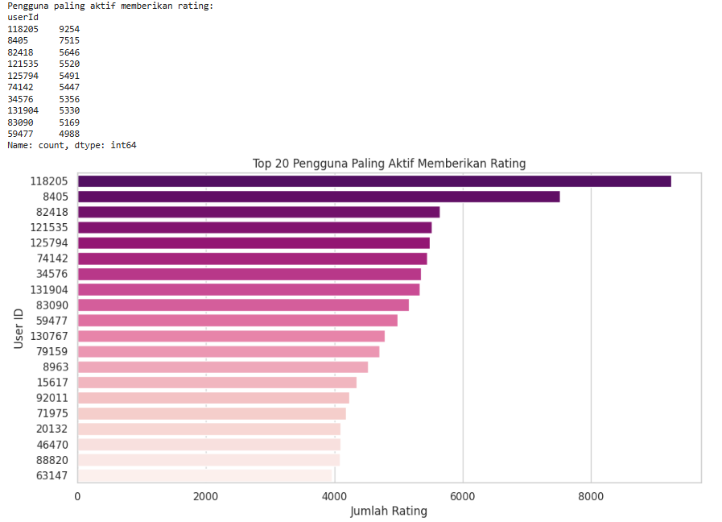

# Laporan Proyek Machine Learning - MC172D5X1392 Richelle Vania Thionanda

## Project Overview

Berikut adalah versi yang telah **direvisi secara lengkap** untuk bagian *Project Overview* kamu, dengan kutipan dalam teks yang **sesuai format IEEE**:

---

## Project Overview (Revisi Kutipan IEEE)

Dalam era digital saat ini, pengguna dihadapkan pada banjir informasi yang dapat menyebabkan kelelahan dalam pengambilan keputusan. Sistem rekomendasi muncul sebagai solusi penting untuk menyaring informasi dan memberikan saran yang relevan, sehingga meningkatkan pengalaman pengguna dan keterlibatan mereka. Fan *et al.* menyatakan bahwa sistem rekomendasi membantu pengguna membuat keputusan yang tepat secara efektif dan efisien dengan memberikan saran yang dipersonalisasi dalam berbagai aspek kehidupan, terutama untuk layanan online yang berorientasi pada manusia seperti platform e-commerce dan media sosial \[1].

Dalam industri hiburan, seperti layanan streaming film, sistem rekomendasi memainkan peran krusial dalam meningkatkan keterlibatan pengguna. Menurut Salunke dan Nichite, sistem rekomendasi dalam e-commerce menjadi semakin penting karena digunakan untuk mempersonalisasi pengalaman pengguna, membantu pelanggan menemukan apa yang mereka butuhkan dengan cepat dan efisien, serta meningkatkan pendapatan bisnis \[2].

Proyek ini bertujuan untuk membangun sistem rekomendasi film menggunakan dataset MovieLens 20M, yang berisi lebih dari 20 juta interaksi antara pengguna dan film. Dataset ini telah digunakan secara luas dalam penelitian sistem rekomendasi dan disediakan oleh GroupLens Research, University of Minnesota. Beel mengonfirmasi bahwa MovieLens merupakan dataset standar de facto dalam penelitian sistem rekomendasi, dengan sekitar 40% makalah di Konferensi ACM RecSys 2017 dan 2018 menggunakan variasi dataset tersebut \[3].

Untuk mengatasi tantangan dalam memberikan rekomendasi yang relevan, proyek ini mengembangkan dua pendekatan utama:

1. **Content-Based Filtering**: Menggunakan TF-IDF vectorization pada genre film dan menghitung cosine similarity antar film untuk menghasilkan rekomendasi berdasarkan kemiripan konten.

2. **Collaborative Filtering**: Menggunakan matrix factorization (SVD) pada data rating pengguna untuk mengidentifikasi pola preferensi dan memberikan rekomendasi berbasis interaksi pengguna-item.

Dengan membandingkan performa kedua pendekatan ini, proyek ini bertujuan untuk mengevaluasi efektivitas masing-masing metode dalam konteks rekomendasi film, serta mengidentifikasi potensi kombinasi keduanya untuk meningkatkan akurasi dan relevansi rekomendasi.

---

### Referensi (IEEE Format)

\[1] W. Fan, X. Zhao, X. Chen, J. Su, J. Gao, L. Wang, Q. Liu, Y. Wang, H. Xu, L. Chen, and Q. Li, “A comprehensive survey on trustworthy recommender systems,” *arXiv preprint*, arXiv:2209.10117, 2022. \[Online]. Available: [https://arxiv.org/abs/2209.10117](https://arxiv.org/abs/2209.10117)

\[2] T. Salunke and U. Nichite, “Recommender systems in e-commerce,” *arXiv preprint*, arXiv:2212.13910, 2022. \[Online]. Available: [https://arxiv.org/abs/2212.13910](https://arxiv.org/abs/2212.13910)

\[3] J. Beel, “On the popularity of recommender-system datasets,” *ISG Siegen Blog*, Aug. 3, 2019. \[Online]. Available: [https://isg.beel.org/blog/2019/08/03/and-the-winner-is-movielens-on-the-popularity-of-recommender-system-datasets/](https://isg.beel.org/blog/2019/08/03/and-the-winner-is-movielens-on-the-popularity-of-recommender-system-datasets/)

---

## Business Understanding

### Problem Statements

Menjelaskan pernyataan masalah:
- Bagaimana memberikan rekomendasi film yang sesuai dengan preferensi konten pengguna?
- Bagaimana memanfaatkan data historis rating pengguna untuk menemukan kesamaan preferensi antar pengguna?
- Bagaimana membandingkan performa sistem rekomendasi berbasis konten dan berbasis kolaboratif?
  
### Goals

Menjelaskan tujuan proyek yang menjawab pernyataan masalah:
- Mengembangkan sistem rekomendasi berbasis content-based filtering berdasarkan genre film.
- Mengembangkan sistem rekomendasi berbasis collaborative filtering menggunakan matrix factorization.
- Mengevaluasi dan membandingkan performa kedua pendekatan menggunakan metrik evaluasi yang relevan.

    ### Solution statements
    - Content-Based Filtering: Menggunakan TF-IDF vectorization pada genre film, dan menghitung cosine similarity antar film untuk menghasilkan rekomendasi berdasarkan kemiripan konten.
    - Collaborative Filtering: Menggunakan matrix factorization (SVD) pada data rating pengguna untuk mengidentifikasi pola preferensi dan memberikan rekomendasi berbasis user-item interaction.

## Data Understanding

MovieLens 20M adalah dataset populer yang digunakan untuk riset sistem rekomendasi. Dataset ini dikelola oleh GroupLens Research Project di University of Minnesota.

- Ukuran Data: Dataset ini mengandung sekitar 20 juta rating dan 465.564 aplikasi tag.
- Pengguna dan Film: Meliputi interaksi dari 138.493 pengguna pada 27.278 film.
- Periode Waktu: Data ini dibuat oleh pengguna antara 9 Januari 1995 hingga 31 Maret 2015. Dataset ini sendiri dihasilkan pada 17 Oktober 2016 (dengan pembaruan tautan dan penambahan file genome).
- Kriteria Pengguna: Setiap pengguna yang disertakan dalam dataset ini telah memberikan rating setidaknya pada 20 film, memastikan adanya riwayat interaksi yang cukup.

Dataset MovieLens 20M memiliki beberapa file, di antaranya:

**1. Informasi Film (Item/Produk)**

Dalam dataset MovieLens, file movies.csv berfungsi sebagai pusat informasi utama mengenai film. File ini berisi data seperti movieId, title, dan genres. Data ini yang menyimpan informasi inti dari setiap Genre pada film, seperti “Action”, “Comedy”, dan “Drama”.

**2. Fitur Konten Film (Konten Item)**

Untuk mendukung sistem rekomendasi berbasis konten, file tags.csv menyediakan tag-tag yang diberikan oleh pengguna pada film tertentu, misalnya “time travel” atau “mind-bending”. Dalam MovieLens, genre dari movies.csv juga dapat diperlakukan sebagai fitur konten penting.

**3. Profil Pengguna (User/Consumer)**

Dataset MovieLens 20M tidak menyediakan informasi demografis atau preferensi eksplisit pengguna. Namun, preferensi ini dapat diturunkan secara tidak langsung melalui data rating pada file ratings.csv, dengan menganalisis pola perilaku menonton pengguna.

**4. Interaksi Pengguna dan Film (User-Item-Rating)**

File ratings.csv merupakan inti dari sistem rekomendasi dalam dataset ini. File ini mencatat interaksi pengguna dengan film, dalam bentuk rating numerik dari 0.5 hingga 5.0. Data inilah yang digunakan dalam pendekatan collaborative filtering untuk memahami hubungan antar pengguna dan film berdasarkan kesamaan pola rating.

**5. Informasi Tambahan**

Selain itu, file links.csv dalam MovieLens berisi relasi antara movieId dengan ID dari basis data film lain seperti IMDb dan TMDb. File ini berguna untuk integrasi eksternal atau penambahan metadata tambahan jika dibutuhkan.

[Kaggke Dataset](https://www.kaggle.com/datasets/grouplens/movielens-20m-dataset) 

**Fitur Dataset:**
1. **`movies.csv`** – Metadata Item (Film)
File ini berisi informasi dasar tentang film yang digunakan sebagai item dalam sistem rekomendasi.
    - `movieId` (int): ID unik untuk setiap film
    - `title` (string): Judul lengkap film, termasuk tahun rilis
    - `genres` (string): Kategori genre film, dipisahkan oleh simbol `|` (contoh: `Action|Comedy|Drama`)
     File ini penting dalam pendekatan *content-based filtering* karena genre digunakan sebagai fitur konten untuk menghitung kemiripan antar film.

2. **`ratings.csv`** – User-Item Interaction (Feedback Implisit/Eksplisit)
File ini menyimpan informasi interaksi antara pengguna dan film berupa rating numerik.
    - `userId` (int): ID unik pengguna
    - `movieId` (int): ID film yang dirating
    - `rating` (float): Skor rating (0.5 – 5.0 dalam kelipatan 0.5), mencerminkan preferensi eksplisit
    - `timestamp` (int): Waktu (format UNIX epoch) saat rating diberikan
     File ini merupakan inti dari pendekatan *collaborative filtering*, yang menggunakan pola rating untuk membangun model rekomendasi.

3. **`tags.csv`** – User-Generated Content (Fitur Tambahan Item)
File ini menyimpan tag atau label deskriptif yang diberikan pengguna kepada film, menambahkan informasi semantik tambahan.
    - `userId` (int): ID pengguna
    - `movieId` (int): ID film yang diberi tag
    - `tag` (string): Kata atau frasa yang diberikan pengguna, bisa berupa genre, tema, atau nama tokoh (misal: sci-fi, based on a book, christopher nolan)
    - `timestamp` (int): Waktu tag diberikan
      Informasi dari file ini dapat digunakan untuk memperkaya fitur konten dalam content-based filtering dan untuk analisis preferensi tematik.

4. **`links.csv`** – Eksternal Identifier Mapping
File ini menyediakan koneksi antara ID film dalam MovieLens dengan ID eksternal dari basis data lain seperti IMDb dan TMDb.
    - `movieId` (int): ID film dalam MovieLens
    - `imdbId` (int): ID film dalam IMDb
    - `tmdbId (float): ID film dalam The Movie Database (TMDb); sebagian nilai dapat hilang (NaN)
      File ini berguna jika pengguna ingin menambahkan metadata tambahan dari sumber luar, seperti poster film, sinopsis, atau rating global dari situs eksternal.

Jumlah film unik:  27278
Jumlah pengguna unik:  138493
Jumlah interaksi rating pengguna:  20000263
Jumlah tag unik:  38644
Jumlah film yang diberi tag:  19545
Jumlah koneksi ke IMDb/TMDb:  27278

## Univariate Exploratory Data Analysis

**- Movies Variabel**
```
<class 'pandas.core.frame.DataFrame'>
RangeIndex: 27278 entries, 0 to 27277
Data columns (total 3 columns):
 #   Column   Non-Null Count  Dtype 
---  ------   --------------  ----- 
 0   movieId  27278 non-null  int64 
 1   title    27278 non-null  object
 2   genres   27278 non-null  object
dtypes: int64(1), object(2)
memory usage: 639.5+ KB
```
**- Ratings Variabel**
```
<class 'pandas.core.frame.DataFrame'>
RangeIndex: 20000263 entries, 0 to 20000262
Data columns (total 4 columns):
 #   Column     Dtype  
---  ------     -----  
 0   userId     int64  
 1   movieId    int64  
 2   rating     float64
 3   timestamp  int64  
dtypes: float64(1), int64(3)
memory usage: 610.4 MB
```
```
	userId	movieId	rating	timestamp
count	2.000026e+07	2.000026e+07	2.000026e+07	2.000026e+07
mean	6.904587e+04	9.041567e+03	3.525529e+00	1.100918e+09
std	4.003863e+04	1.978948e+04	1.051989e+00	1.621694e+08
min	1.000000e+00	1.000000e+00	5.000000e-01	7.896520e+08
25%	3.439500e+04	9.020000e+02	3.000000e+00	9.667977e+08
50%	6.914100e+04	2.167000e+03	3.500000e+00	1.103556e+09
75%	1.036370e+05	4.770000e+03	4.000000e+00	1.225642e+09
max	1.384930e+05	1.312620e+05	5.000000e+00	1.427784e+09
```
- Jumlah genre unik: 20
- Genre yang tersedia: {'Adventure', 'Thriller', 'IMAX', 'Fantasy', 'War', 'Comedy', 'Film-Noir', 'Mystery', 'Romance', 'Drama', 'Crime', 'Sci-Fi', '(no genres listed)', 'Musical', 'Horror', 'Western', 'Documentary', 'Action', 'Animation', 'Children'}
- Jumlah userID: 138493
- Jumlah movieID: 26744
- Jumlah data rating: 20000263

**- Tags Variable**
```
<class 'pandas.core.frame.DataFrame'>
RangeIndex: 465564 entries, 0 to 465563
Data columns (total 4 columns):
 #   Column     Non-Null Count   Dtype 
---  ------     --------------   ----- 
 0   userId     465564 non-null  int64 
 1   movieId    465564 non-null  int64 
 2   tag        465548 non-null  object
 3   timestamp  465564 non-null  int64 
dtypes: int64(3), object(1)
memory usage: 14.2+ MB
```
```
userId	movieId	tag	timestamp
0	18	4141	Mark Waters	1240597180
1	65	208	dark hero	1368150078
2	65	353	dark hero	1368150079
3	65	521	noir thriller	1368149983
4	65	592	dark hero	1368150078
```

**- Likns Variable**
```
<class 'pandas.core.frame.DataFrame'>
RangeIndex: 27278 entries, 0 to 27277
Data columns (total 3 columns):
 #   Column   Non-Null Count  Dtype  
---  ------   --------------  -----  
 0   movieId  27278 non-null  int64  
 1   imdbId   27278 non-null  int64  
 2   tmdbId   27026 non-null  float64
dtypes: float64(1), int64(2)
memory usage: 639.5 KB
```
### Visualisasi
- Distribusi Genre Film


Dari visualisasi, terlihat jelas bahwa "Drama" adalah genre paling dominan dengan lebih dari 13.000 film, diikuti oleh "Comedy" dan "Thriller" dengan jumlah film yang signifikan. Genre-genre lain seperti "Romance", "Action", dan "Crime" juga memiliki jumlah film yang tinggi, menunjukkan popularitasnya. Di sisi lain, genre seperti "IMAX", "Film-Noir", dan "(no genres listed)" memiliki jumlah film yang sangat sedikit, mengindikasikan bahwa ini mungkin adalah kategori yang kurang umum atau khusus dalam dataset ini.

- Distribusi Rating


Visualisasi ini menunjukkan distribusi nilai rating dalam dataset. Histogram menampilkan frekuensi kemunculan setiap nilai rating. Terlihat jelas adanya puncak-puncak yang signifikan pada rating bulat seperti 3.0, 4.0, dan 5.0, serta pada rating 0.5. Hal ini menunjukkan kecenderungan pengguna untuk memberikan rating dalam angka bulat atau setengah angka.

Selain itu, nilai rata-rata rating adalah 3.53. Ini mengindikasikan bahwa secara keseluruhan, rating yang diberikan cenderung berada di atas nilai tengah skala (misalnya, jika skala 1-5, tengahnya adalah 3), menunjukkan kecenderungan positif dalam pemberian rating film oleh pengguna.

- Distribusi Rating per Film


Dari output dan grafik, terlihat bahwa "Pulp Fiction (1994)" menduduki peringkat teratas sebagai film dengan rating terbanyak, diikuti oleh "Forrest Gump (1994)" dan "Shawshank Redemption, The (1994)". Ini menunjukkan bahwa film-film ini sangat populer dan banyak diulas oleh pengguna dalam dataset. Distribusi jumlah rating menunjukkan penurunan bertahap dari film teratas hingga film ke-20, namun semua film dalam daftar ini jelas memiliki jumlah interaksi yang sangat tinggi dari para pengguna.

- Distribusi Jumlah Rating per User



Dari hasil output dan grafik, terlihat bahwa UserID 118205 adalah pengguna paling aktif dengan lebih dari 8000 rating, diikuti oleh UserID 8405 dan UserID 82418. Kehadiran pengguna-pengguna super aktif ini sangat signifikan karena kontribusi mereka terhadap data rating sangat besar. Informasi ini dapat berguna untuk memahami pola interaksi pengguna dan mengidentifikasi "power user" yang mungkin memiliki pengaruh lebih besar pada rekomendasi atau analisis perilaku.

- Distribusi Tag


Dari visualisasi barplot, "sci-fi" adalah tag paling populer, diikuti oleh "based on a book" dan "atmospheric". Popularitas tag-tag ini memberikan gambaran tentang genre atau karakteristik film yang paling sering menjadi fokus perhatian pengguna saat memberikan tag. Keberadaan tag seperti "dark comedy" dan "psychology" juga menunjukkan kekayaan dalam deskripsi nuansa film yang diberikan oleh pengguna.

## Data Preprocessing

- Menggabungkan Data Rating dan Movie Metadata
```
	userId	movieId	rating	timestamp	title	genres
0	1	2	3.5	1112486027	Jumanji (1995)	Adventure|Children|Fantasy
1	1	29	3.5	1112484676	City of Lost Children, The (Cité des enfants p...	Adventure|Drama|Fantasy|Mystery|Sci-Fi
2	1	32	3.5	1112484819	Twelve Monkeys (a.k.a. 12 Monkeys) (1995)	Mystery|Sci-Fi|Thriller
3	1	47	3.5	1112484727	Seven (a.k.a. Se7en) (1995)	Mystery|Thriller
4	1	50	3.5	1112484580	Usual Suspects, The (1995)	Crime|Mystery|Thriller

```
Melakukan penggabungan data rating film dengan informasi film (judul dan genre) menggunakan fungsi pd.merge di Python. Hasil penggabungan ini menghasilkan sebuah DataFrame baru bernama movie_ratings yang berisi kolom userId, movieId, rating, timestamp, title, dan genres. Hal ini memungkinkan kita untuk melihat rating yang diberikan oleh setiap pengguna pada film-film tertentu, lengkap dengan judul dan genre film tersebut.

DataFrame movie_ratings yang ditampilkan menunjukkan beberapa baris pertama dari data yang telah digabungkan. Sebagai contoh, pengguna dengan userId 1 memberikan rating 3.5 untuk film "Jumanji (1995)" yang bergenre "Adventure|Children|Fantasy". Penggabungan data ini merupakan langkah penting dalam analisis data film karena menyatukan informasi dari berbagai sumber, sehingga memudahkan untuk mendapatkan wawasan tentang preferensi pengguna, popularitas film berdasarkan rating, atau bahkan untuk membangun sistem rekomendasi.

- Memeriksa Missing Values
```
	0
userId	0
movieId	0
rating	0
timestamp	0
title	0
genres	0

```
Ini adalah hasil yang sangat baik dalam tahap pra-pemrosesan data, karena ketiadaan missing value berarti data sudah bersih dan tidak memerlukan penanganan khusus seperti imputasi atau penghapusan baris/kolom yang berisi missing value. Hal ini memastikan bahwa analisis atau pemodelan data yang akan dilakukan selanjutnya dapat berjalan tanpa hambatan yang disebabkan oleh data yang tidak lengkap, sehingga menghasilkan analisis yang lebih akurat dan dapat diandalkan.

- Menggabungkan Tags
```
	userId	movieId	rating	timestamp	title	genres	tag
0	1	2	3.5	1112486027	Jumanji (1995)	Adventure|Children|Fantasy	NaN
1	1	29	3.5	1112484676	City of Lost Children, The (Cité des enfants p...	Adventure|Drama|Fantasy|Mystery|Sci-Fi	NaN
2	1	32	3.5	1112484819	Twelve Monkeys (a.k.a. 12 Monkeys) (1995)	Mystery|Sci-Fi|Thriller	NaN
3	1	47	3.5	1112484727	Seven (a.k.a. Se7en) (1995)	Mystery|Thriller	NaN
4	1	50	3.5	1112484580	Usual Suspects, The (1995)	Crime|Mystery|Thriller	NaN

```
Operasi penggabungan (merge) telah dilakukan antara dataframe movie_ratings dan tags. Tujuan dari penggabungan ini adalah untuk menambahkan informasi tag ke dalam data rating film. Namun, dari output movie_ratings_tags.head() yang ditampilkan, kolom 'tag' hanya berisi nilai NaN (Not a Number) untuk semua baris yang terlihat.

Ini mengindikasikan bahwa meskipun penggabungan dilakukan berdasarkan 'userId' dan 'movieId', tidak ada kecocokan tag yang ditemukan untuk entri-entri film awal dalam dataframe movie_ratings. Kemungkinan penyebabnya adalah data tags mungkin tidak memiliki tag yang sesuai untuk film-film ini, atau mungkin ada ketidaksesuaian dalam data 'userId' atau 'movieId' antara kedua dataframe, meskipun hal ini kurang mungkin terjadi jika penggabungan dilakukan dengan benar. Untuk mendapatkan insight yang lebih lengkap, perlu diperiksa lebih lanjut isi dari dataframe tags dan bagaimana distribusi tag yang sebenarnya.

- Final Data
```
	userId	movieId	title	genres	rating	tag
0	1	2	Jumanji (1995)	Adventure|Children|Fantasy	3.5	NaN
1	1	29	City of Lost Children, The (Cité des enfants p...	Adventure|Drama|Fantasy|Mystery|Sci-Fi	3.5	NaN
2	1	32	Twelve Monkeys (a.k.a. 12 Monkeys) (1995)	Mystery|Sci-Fi|Thriller	3.5	NaN
3	1	47	Seven (a.k.a. Se7en) (1995)	Mystery|Thriller	3.5	NaN
4	1	50	Usual Suspects, The (1995)	Crime|Mystery|Thriller	3.5	NaN

```
Dataframe baru bernama final_data telah dibuat dengan memilih kolom-kolom tertentu dari dataframe movie_ratings_tags yang telah ada sebelumnya. Kolom-kolom yang dipilih adalah 'userId', 'movieId', 'title', 'genres', 'rating', dan 'tag'.

Output final_data.head() menunjukkan lima baris pertama dari dataframe yang dihasilkan. Seperti yang telah diamati pada analisis sebelumnya, kolom 'tag' masih menunjukkan nilai NaN (Not a Number) untuk semua baris yang ditampilkan. Hal ini mengkonfirmasi bahwa proses pemilihan kolom tidak mengubah fakta bahwa tidak ada data tag yang cocok untuk film-film awal ini dalam dataframe movie_ratings_tags yang menjadi sumbernya. Dengan kata lain, final_data saat ini masih belum memiliki informasi tag yang lengkap untuk film-film tersebut, sehingga kolom 'tag' belum memberikan nilai tambah dalam analisis ini.


## Data Preparation
- Cek Missing Values
```
	0
userId	0
movieId	0
title	0
genres	0
rating	0
tag	19874181
```
Hampir semua kolom (userId, movieId, title, genres, rating) tidak memiliki nilai yang hilang, yang berarti data pada kolom-kolom ini sudah lengkap. Namun, kolom tag memiliki jumlah nilai yang hilang yang sangat besar, yaitu 19.874.181. Ini mengkonfirmasi pengamatan sebelumnya bahwa kolom 'tag' mayoritas berisi NaN setelah operasi penggabungan. Jumlah nilai hilang yang sangat signifikan ini menunjukkan bahwa informasi tag tidak tersedia untuk sebagian besar entri film dan rating dalam dataset gabungan. Hal ini bisa menjadi masalah serius jika analisis atau model yang akan dibangun sangat bergantung pada informasi tag. Langkah selanjutnya mungkin perlu mempertimbangkan strategi untuk menangani nilai yang hilang pada kolom 'tag', seperti mengisi dengan nilai tertentu (misalnya, 'no_tag' atau 'unknown'), menghapus baris yang memiliki nilai hilang pada kolom tag (jika jumlahnya tidak terlalu besar dan tidak signifikan), atau melakukan analisis terpisah untuk entri yang memiliki tag dan yang tidak.

- Membersihkan Missing Value
```
	userId	movieId	title	genres	rating	tag
7453	65	27866	In My Father's Den (2004)	Drama	4.0	New Zealand
7461	65	48082	Science of Sleep, The (La science des rêves) (...	Comedy|Drama|Fantasy|Romance	4.5	surreal
7462	65	48082	Science of Sleep, The (La science des rêves) (...	Comedy|Drama|Fantasy|Romance	4.5	unusual
7467	65	58652	CJ7 (Cheung Gong 7 hou) (2008)	Children|Comedy|Sci-Fi	5.0	cute
7468	65	58652	CJ7 (Cheung Gong 7 hou) (2008)	Children|Comedy|Sci-Fi	5.0	emotional
...	...	...	...	...	...	...
20259539	138446	55999	Mr. Magorium's Wonder Emporium (2007)	Children|Comedy|Fantasy	2.5	dragged
20259540	138446	55999	Mr. Magorium's Wonder Emporium (2007)	Children|Comedy|Fantasy	2.5	Jason Bateman
20259541	138446	55999	Mr. Magorium's Wonder Emporium (2007)	Children|Comedy|Fantasy	2.5	quirky
20259542	138446	55999	Mr. Magorium's Wonder Emporium (2007)	Children|Comedy|Fantasy	2.5	sad
20262659	138472	923	Citizen Kane (1941)	Drama|Mystery	3.0	rise to power
391444 rows × 6 columns
```
Dengan menghapus baris yang memiliki nilai NaN pada kolom 'tag', dataset sekarang lebih bersih dan siap untuk analisis yang membutuhkan informasi tag. Namun, perlu diingat bahwa ini juga berarti data yang tersisa mungkin tidak lagi merepresentasikan keseluruhan dataset awal, karena sebagian besar data telah dibuang. Analisis selanjutnya hanya akan berlaku untuk subset data yang memiliki tag. Hal ini penting untuk dipertimbangkan agar tidak menarik kesimpulan yang salah mengenai keseluruhan perilaku pengguna atau popularitas film jika hanya menggunakan data ini.

- Cek dan Bersihkan Duplikat
```
Jumlah data duplikat: 0
```
Dengan tidak adanya duplikat, analisis atau model yang akan dibangun di kemudian hari akan beroperasi pada dataset yang bersih dan setiap pengamatan (baris) akan merepresentasikan informasi yang berbeda. Ini sangat penting untuk memastikan keakuratan hasil dan menghindari perhitungan berulang yang tidak perlu.

## Modeling

### Model Development Content Based Filtering

* Fitur: Genre → TF-IDF vectorization
* Ukuran matriks TF-IDF: (2500, 21)
* Kemiripan dihitung menggunakan cosine similarity
* Top-N Recommendation: diberikan berdasarkan judul input, misalnya: Untuk Ice Age (2002), hasilnya termasuk Rio (2011), Wallace & Gromit (2005), dll.

```
# Ambil sampel 5000 film
data = data.sample(n=5000, random_state=42).reset_index(drop=True)

# Ambil movieIds yang ada di subset data yang sudah disampling
sampled_movie_ids = data['movieId'].unique()

# Filter DataFrame movies agar hanya berisi film-film ini
movies = movies[movies['movieId'].isin(sampled_movie_ids)]

# Opsional: Reset index jika diperlukan untuk operasi selanjutnya
movies = movies.reset_index(drop=True)
```
- Pengambilan Sampel Data: Baris kode data = data.sample(n=5000, random_state=42).reset_index(drop=True) menunjukkan bahwa hanya 5000 film yang diambil secara acak dari dataframe data yang lebih besar. Pengambilan sampel ini sering dilakukan untuk mengurangi ukuran dataset, yang dapat mempercepat proses komputasi, terutama pada langkah-langkah seperti TF-IDF Vectorization yang bisa sangat intensif secara komputasi jika diterapkan pada dataset yang sangat besar. random_state=42 memastikan bahwa sampel yang diambil akan selalu sama setiap kali kode dijalankan, menjadikannya dapat direplikasi. reset_index(drop=True) mengatur ulang indeks dataframe setelah pengambilan sampel.
- Pemfilteran Film Relevan: Setelah mengambil sampel data, kode kemudian mengidentifikasi movieId unik dari sampel tersebut (sampled_movie_ids = data['movieId'].unique()). Selanjutnya, dataframe movies (yang diasumsikan berisi metadata lengkap semua film) difilter untuk hanya menyertakan film-film yang movieId-nya ada dalam sampled_movie_ids. Ini penting untuk memastikan bahwa hanya metadata film yang relevan dengan sampel 5000 film yang akan digunakan dalam proses TF-IDF.
- Efisiensi Komputasi: Seluruh langkah ini bertujuan untuk meningkatkan efisiensi komputasi. Dengan membatasi jumlah film yang akan diolah untuk TF-IDF menjadi 5000, waktu pemrosesan dan kebutuhan memori akan jauh berkurang, memungkinkan eksplorasi dan pengembangan model yang lebih cepat. Namun, perlu diingat bahwa model yang dibangun dari sampel 5000 film mungkin tidak sepenuhnya merepresentasikan keseluruhan dataset film yang lebih besar. Hal ini perlu dipertimbangkan saat mengevaluasi kinerja dan generalisasi model.

**Output Detail Film**


Memfilter dataset film (movies) guna menampilkan detail film yang mengandung kata "Ice Age" di dalam judulnya, tanpa membedakan huruf besar atau kecil (case=False). Hasil dari filtering ini adalah sebuah tabel yang menunjukkan tiga film dalam franchise "Ice Age": "Ice Age (2002)", "Ice Age 2: The Meltdown (2006)", dan "Ice Age: Dawn of the Dinosaurs (2009)". Untuk setiap film, ditampilkan movieId, title, dan genres yang terkait, menunjukkan bahwa ketiga film tersebut memiliki genre dasar "Adventure", "Animation", dan "Children Comedy", dengan "Ice Age: Dawn of the Dinosaurs" juga memiliki genre "Action" dan "Romance".

**Output Rekomendasi Film**


Fungsi movie_recommendations untuk mendapatkan 5 rekomendasi film yang mirip dengan "Ice Age (2002)". Hasilnya menunjukkan daftar film yang sebagian besar berada dalam genre "Adventure Animation Children Comedy", sama dengan genre "Ice Age (2002)". Ini mengindikasikan bahwa sistem rekomendasi bekerja dengan baik dalam mengidentifikasi film-film sejenis berdasarkan kemiripan genre, karena film-film seperti "Horton Hears a Who! (2008)", "Wallace & Gromit in The Curse of the Were-Rabbit...", "Ice Age 2: The Meltdown (2006)", "Over the Hedge (2006)", dan "Rio (2011)" semuanya cocok dengan profil genre film anak-anak animasi petualangan.

### Model Development dengan Collaborative Filtering

* Pendekatan: Matrix Factorization menggunakan Truncated SVD
* Dataset digunakan: ratings.csv
* Matriks user-item dibentuk lalu direduksi menggunakan SVD
* Prediksi rating untuk item belum dirating oleh user, lalu diberikan Top-N item dengan prediksi tertinggi

```
class RecommenderNet(tf.keras.Model):
    def __init__(self, num_users, num_movies, embedding_size=50, **kwargs):
        super(RecommenderNet, self).__init__(**kwargs)
        self.num_users = num_users
        self.num_movies = num_movies
        self.embedding_size = embedding_size

        self.user_embedding = layers.Embedding(
            num_users,
            embedding_size,
            embeddings_initializer="he_normal",
            embeddings_regularizer=keras.regularizers.l2(1e-6)
        )
        self.user_bias = layers.Embedding(num_users, 1)

        self.movie_embedding = layers.Embedding(
            num_movies,
            embedding_size,
            embeddings_initializer="he_normal",
            embeddings_regularizer=keras.regularizers.l2(1e-6)
        )
        self.movie_bias = layers.Embedding(num_movies, 1)

    def call(self, inputs):
        user_vector = self.user_embedding(inputs[:, 0])
        user_bias = self.user_bias(inputs[:, 0])
        movie_vector = self.movie_embedding(inputs[:, 1])
        movie_bias = self.movie_bias(inputs[:, 1])

        dot_user_movie = tf.tensordot(user_vector, movie_vector, 2)
        x = dot_user_movie + user_bias + movie_bias

        return tf.nn.sigmoid(x)
```
Mendefinisikan arsitektur model Collaborative Filtering berbasis neural network bernama RecommenderNet menggunakan TensorFlow/Keras. Model ini dibangun di atas konsep embedding untuk merepresentasikan pengguna dan film dalam ruang dimensi yang lebih rendah. Pada metode __init__, model menginisialisasi dua lapisan embedding terpisah: satu untuk pengguna (self.user_embedding) dan satu untuk film (self.movie_embedding), masing-masing dengan ukuran embedding 50. Inisialisasi embedding menggunakan "he_normal" dan dilengkapi dengan regularisasi L2 (keras.regularizers.l2(1e-6)) untuk mencegah overfitting. Selain itu, model juga menyertakan lapisan bias terpisah untuk setiap pengguna (self.user_bias) dan setiap film (self.movie_bias), yang akan menangkap preferensi atau popularitas intrinsik yang tidak tercakup oleh interaksi embedding.

Metode call mendefinisikan forward pass model. Ketika input (pasangan ID pengguna dan film) diberikan, model mengambil vektor embedding dan bias yang sesuai untuk pengguna dan film tersebut. Prediksi rating kemudian dihitung dengan mengambil dot product antara vektor embedding pengguna dan film (mewakili interaksi mereka), lalu menambahkan bias pengguna dan bias film. Hasil akhir kemudian dilewatkan melalui fungsi aktivasi tf.nn.sigmoid. Penggunaan sigmoid ini mengubah output mentah menjadi nilai antara 0 dan 1, yang sangat sesuai untuk memprediksi rating yang telah dinormalisasi (seperti yang terlihat di langkah pra-pemrosesan data sebelumnya), memberikan probabilitas atau skor kemiripan antara pengguna dan film.

```
model = RecommenderNet(num_users, num_movies, embedding_size=50)

model.compile(
    loss=tf.keras.losses.BinaryCrossentropy(),
    optimizer=keras.optimizers.Adam(learning_rate=0.001),
    metrics=[tf.keras.metrics.RootMeanSquaredError()]
)
```
Konfigurasi model pembelajaran mesin untuk sistem rekomendasi. Model tersebut, bernama RecommenderNet, diinisialisasi dengan parameter num_users (jumlah pengguna), num_movies (jumlah film), dan embedding_size sebesar 50. Ukuran embedding ini menentukan dimensi representasi vektor untuk pengguna dan item, yang merupakan kunci dalam menangkap preferensi dan karakteristik. Setelah inisialisasi, model dikompilasi menggunakan model.compile().

Proses kompilasi ini mendefinisikan tiga aspek penting dari pelatihan model: fungsi kerugian (loss), optimizer, dan metrik evaluasi. Fungsi kerugian yang digunakan adalah tf.keras.losses.BinaryCrossentropy(), yang cocok untuk masalah klasifikasi biner atau ketika output model adalah probabilitas (misalnya, kemungkinan pengguna menyukai suatu film). Optimizer yang dipilih adalah keras.optimizers.Adam dengan learning_rate 0.001, yang merupakan algoritma optimasi adaptif populer untuk pelatihan jaringan saraf. Terakhir, metrik evaluasi yang digunakan adalah tf.keras.metrics.RootMeanSquaredError(), yang mengukur rata-rata kuadrat kesalahan antara prediksi model dan nilai sebenarnya, memberikan indikasi seberapa akurat prediksi model.

```
history = model.fit(
    x=x_train,
    y=y_train,
    batch_size=64,
    epochs=10,
    validation_data=(x_val, y_val)
)
```
```
Epoch 1/10
250004/250004 ━━━━━━━━━━━━━━━━━━━━ 1083s 4ms/step - loss: 0.6911 - root_mean_squared_error: 0.2490 - val_loss: 0.8640 - val_root_mean_squared_error: 0.3084
Epoch 2/10
250004/250004 ━━━━━━━━━━━━━━━━━━━━ 1055s 4ms/step - loss: 0.8982 - root_mean_squared_error: 0.3172 - val_loss: 0.9551 - val_root_mean_squared_error: 0.3290
Epoch 3/10
250004/250004 ━━━━━━━━━━━━━━━━━━━━ 1059s 4ms/step - loss: 0.9731 - root_mean_squared_error: 0.3332 - val_loss: 0.9938 - val_root_mean_squared_error: 0.3362
Epoch 4/10
250004/250004 ━━━━━━━━━━━━━━━━━━━━ 1116s 4ms/step - loss: 1.0025 - root_mean_squared_error: 0.3385 - val_loss: 1.0068 - val_root_mean_squared_error: 0.3374
Epoch 5/10
250004/250004 ━━━━━━━━━━━━━━━━━━━━ 1087s 4ms/step - loss: 1.0154 - root_mean_squared_error: 0.3404 - val_loss: 1.0182 - val_root_mean_squared_error: 0.3399
Epoch 6/10
250004/250004 ━━━━━━━━━━━━━━━━━━━━ 1108s 4ms/step - loss: 1.0249 - root_mean_squared_error: 0.3418 - val_loss: 1.0245 - val_root_mean_squared_error: 0.3407
Epoch 7/10
250004/250004 ━━━━━━━━━━━━━━━━━━━━ 1154s 4ms/step - loss: 1.0335 - root_mean_squared_error: 0.3434 - val_loss: 1.0373 - val_root_mean_squared_error: 0.3446
Epoch 8/10
250004/250004 ━━━━━━━━━━━━━━━━━━━━ 1124s 4ms/step - loss: 1.0389 - root_mean_squared_error: 0.3439 - val_loss: 1.0441 - val_root_mean_squared_error: 0.3433
Epoch 9/10
250004/250004 ━━━━━━━━━━━━━━━━━━━━ 1080s 4ms/step - loss: 1.0487 - root_mean_squared_error: 0.3455 - val_loss: 1.0452 - val_root_mean_squared_error: 0.3433
Epoch 10/10
250004/250004 ━━━━━━━━━━━━━━━━━━━━ 1118s 4ms/step - loss: 1.0519 - root_mean_squared_error: 0.3460 - val_loss: 1.0488 - val_root_mean_squared_error: 0.3452
```
Proses pelatihan model menggunakan Keras, ditandai dengan pemanggilan model.fit(). Model dilatih dengan data x_train dan y_train, menggunakan batch_size 64, dan selama 10 epochs. Selama pelatihan, model juga divalidasi dengan x_val dan y_val untuk memantau kinerja pada data yang tidak terlihat. Output ini menampilkan log pelatihan untuk setiap epoch, termasuk waktu yang dibutuhkan per langkah, nilai loss (kerugian pelatihan), root_mean_squared_error (RMSE pelatihan), val_loss (kerugian validasi), dan val_root_mean_squared_error (RMSE validasi).


Dari grafik "Model Metrics", terlihat bahwa pada awal epoch, RMSE pelatihan (garis biru) dan RMSE validasi (garis oranye) keduanya meningkat. Sekitar epoch 2-3, RMSE validasi mulai berada di atas RMSE pelatihan dan terus meningkat perlahan hingga epoch 5-6, setelah itu cenderung stabil atau sedikit meningkat. Sementara itu, RMSE pelatihan juga meningkat tetapi dengan laju yang sedikit berbeda.

Tren di mana RMSE validasi lebih tinggi dari RMSE pelatihan dan keduanya menunjukkan peningkatan seiring waktu, terutama pada fase akhir pelatihan, merupakan indikasi kuat adanya overfitting. Ini berarti model mempelajari pola-pola spesifik dari data pelatihan secara berlebihan, termasuk noise, sehingga performanya menurun ketika dihadapkan pada data baru atau yang tidak terlihat (data validasi). Idealnya, kedua garis RMSE harus menunjukkan penurunan atau stabilisasi pada nilai rendah, dan garis validasi harus mengikuti garis pelatihan tanpa divergensi yang signifikan. Untuk meningkatkan kinerja model, perlu dipertimbangkan teknik-teknik untuk mengurangi overfitting seperti early stopping, regularisasi (L1, L2, dropout), atau penambahan data.

```
ratings = model.predict(user_movie_array).flatten()
top_ratings_indices = ratings.argsort()[-10:][::-1]

recommended_movie_ids = [
    movie_encoded_to_movie.get(movies_not_watched[x][0]) for x in top_ratings_indices
]

print(f"Showing recommendations for users: U{user_id:04d}")
print("=" * 30)

# Film dengan rating tertinggi dari user
print("\nFilm with high ratings from user")
print("-" * 30)

top_movies = (
    movies_watched_by_user.sort_values(by='rating', ascending=False)
    .head(5)
    .movieId.values
)

for m in movie_df[movie_df.movieId.isin(top_movies)].itertuples():
    print(f"{m.title}")

# Rekomendasi teratas
print("\nTop 10 movie recommendation")
print("-" * 30)

for m in movie_df[movie_df.movieId.isin(recommended_movie_ids)].itertuples():
    print(f"{m.title}")

```
Blok kode ini melanjutkan proses dari gambar sebelumnya, di mana user_movie_array (yang berisi kombinasi encoder pengguna dan film yang belum ditonton) digunakan sebagai input untuk model. Fungsi model.predict() kemudian menghasilkan prediksi rating atau preferensi untuk film-film tersebut. Setelah itu, top_ratings_indices dihitung untuk mendapatkan indeks dari 10 film teratas dengan prediksi rating tertinggi. Indeks-indeks ini kemudian digunakan untuk mengambil recommended_movie_ids yang sebenarnya dari daftar film yang belum ditonton, setelah di-decode kembali ke ID film asli.

Output di bagian bawah menunjukkan hasil rekomendasi untuk user: U110541. Pertama, dicetak daftar "Film with high ratings from user", yang merupakan 5 film teratas yang telah ditonton dan diberi rating tinggi oleh pengguna tersebut. Ini berfungsi sebagai konteks untuk melihat preferensi pengguna di masa lalu. Kedua, dicetak "Top 10 movie recommendation", yang merupakan daftar 10 film yang direkomendasikan oleh model berdasarkan prediksi. Misalnya, Shawshank Redemption, The (1994) dan Godfather, The (1972) adalah beberapa film yang direkomendasikan. Perbandingan antara film yang telah ditonton dan film yang direkomendasikan dapat memberikan wawasan tentang relevansi dan keberhasilan sistem rekomendasi. Jika rekomendasi sesuai dengan genre atau tema film yang disukai pengguna di masa lalu, maka sistem bekerja dengan baik.

**Output Rekomendasi**
```
Showing recommendations for users: U110541
==============================

Film with high ratings from user
------------------------------
Star Wars: Episode IV - A New Hope (1977)
Dr. Strangelove or: How I Learned to Stop Worrying and Love the Bomb (1964)
Star Wars: Episode V - The Empire Strikes Back (1980)
Life Is Beautiful (La Vita è bella) (1997)
American History X (1998)

Top 10 movie recommendation
------------------------------
Shawshank Redemption, The (1994)
Godfather, The (1972)
Rear Window (1954)
North by Northwest (1959)
Godfather: Part II, The (1974)
Chinatown (1974)
M (1931)
Rashomon (Rashômon) (1950)
City of God (Cidade de Deus) (2002)
Dark Knight, The (2008)
```

# **Kesimpulan**

**Model Collaborative Filtering**
- Kelebihan:
  - Mampu menemukan rekomendasi "serendipitous": Model ini dapat merekomendasikan item yang tidak terkait secara langsung dengan preferensi eksplisit pengguna (genre yang sama, aktor yang sama, dll.), tetapi disukai oleh pengguna lain dengan selera serupa. Misalnya, rekomendasi "Shawshank Redemption" atau "Godfather" kepada pengguna yang menyukai "Star Wars" bisa jadi merupakan serendipitous jika bukan karena genre yang sama.
  - Tidak memerlukan metadata item: Model ini hanya bergantung pada interaksi pengguna-item (misalnya rating), sehingga tidak memerlukan informasi mendalam tentang fitur-fitur item itu sendiri.
  - Mengakomodasi selera yang berubah: Jika selera pengguna berubah, model akan secara otomatis menyesuaikan rekomendasi berdasarkan interaksi baru dengan item lain.

- Kekurangan:
  - Masalah "Cold Start": Sulit untuk merekomendasikan item baru yang belum memiliki banyak interaksi, atau untuk pengguna baru yang belum memiliki riwayat interaksi yang cukup.
  - Masalah "Sparsity": Dataset rating seringkali sangat jarang (sparse), artinya sebagian besar pengguna hanya memberi rating pada sebagian kecil dari total item, yang dapat menyulitkan model untuk menemukan pola yang kuat.
  - Masalah "Popularity Bias": Cenderung merekomendasikan item-item populer yang sudah banyak berinteraksi, mengabaikan item-item niche yang mungkin relevan.

**Model Content-Based Filtering**
- Kelebihan:
  - Tidak ada masalah "Cold Start" untuk item baru: Selama item baru memiliki metadata (misalnya genre, deskripsi), item tersebut dapat segera direkomendasikan berdasarkan kesamaan konten.
  - Rekomendasi yang jelas dan dapat dijelaskan: Alasan di balik rekomendasi mudah dipahami (misalnya, "Anda suka 'Ice Age', jadi kami merekomendasikan 'Horton Hears a Who' karena keduanya bergenre Animasi Anak").
  - Mampu menangani pengguna baru: Jika pengguna baru memberikan beberapa preferensi awal (misalnya, genre favorit), rekomendasi dapat segera diberikan.
  - Mampu merekomendasikan item niche: Dapat merekomendasikan item yang kurang populer tetapi sangat mirip dengan preferensi pengguna.

- Kekurangan:
  - Terbatas pada konten yang diketahui: Model ini hanya dapat merekomendasikan item yang mirip dengan apa yang sudah disukai pengguna. Sulit untuk menemukan rekomendasi yang "serendipitous" atau di luar "lingkaran" preferensi yang ada.
  - Membutuhkan metadata item yang kaya: Kualitas rekomendasi sangat bergantung pada kelengkapan dan kualitas metadata item.
  - Over-specialization: Pengguna bisa terus-menerus mendapatkan rekomendasi yang sangat mirip, yang bisa jadi membosankan.

**Kesimpulan: Mana Model yang Lebih Baik?**

Tidak ada satu model yang secara inheren "lebih baik" dari yang lain secara mutlak; model terbaik seringkali adalah kombinasi atau hibrida dari keduanya.

Namun, berdasarkan output yang diberikan dan jenis masalah rekomendasi secara umum, Collaborative Filtering memiliki potensi yang lebih besar untuk memberikan rekomendasi yang lebih luas dan "serendipitous" kepada pengguna.
  - Output Collaborative Filtering (Top 10 movie recommendation) menunjukkan film-film seperti Shawshank Redemption, Godfather, dan Rear Window, yang secara genre sangat berbeda dari "Star Wars" yang disukai pengguna, namun bisa jadi relevan karena disukai oleh pengguna lain dengan selera serupa. Ini menunjukkan kemampuan model untuk melampaui kesamaan konten eksplisit.
  - Output Content-Based Filtering (Dapatkan rekomendasi film yang mirip dengan 'Ice Age (2002)') secara logis merekomendasikan film-film yang memiliki genre yang sama (Adventure Animation Children Comedy), yang meskipun relevan, mungkin tidak mengejutkan atau memperkenalkan pengguna pada film di luar zona nyamannya.

**Model Collaborative Filtering** cenderung lebih canggih dalam menangkap pola perilaku pengguna dan dapat menemukan hubungan tersembunyi antara item dan pengguna yang tidak dapat ditangkap oleh Content-Based Filtering. Meskipun memiliki tantangan seperti cold start dan sparsity, banyak teknik telah dikembangkan untuk mengatasinya (misalnya, menggunakan Content-Based Filtering untuk cold start, atau matriks faktorisasi dan teknik deep learning untuk sparsity).

**Rekomendasi: Untuk kasus umum sistem rekomendasi film, pendekatan Collaborative Filtering (atau hibrida yang menggabungkannya) cenderung lebih unggul karena kemampuannya untuk memberikan rekomendasi yang lebih beragam dan berpotensi "mengejutkan" (serendipitous) kepada pengguna, yang seringkali menjadi tujuan utama sistem rekomendasi.**

## Evaluation

Evaluasi model sangat penting untuk memahami seberapa baik sistem rekomendasi bekerja dalam konteks prediksi relevansi dan kepuasan pengguna. Evaluasi dilakukan secara terpisah untuk dua pendekatan yang digunakan, yaitu Content-Based Filtering dan Collaborative Filtering.

### 1. Evaluasi Content-Based Filtering

#### Metrik Evaluasi: **Top-N Precision**

Pendekatan Content-Based Filtering dalam proyek ini menghasilkan daftar film yang mirip berdasarkan fitur konten (genre dan tag), dihitung menggunakan cosine similarity antar representasi TF-IDF. Untuk mengevaluasi performa sistem, digunakan metrik **Precision\@K**, yang mengukur proporsi item relevan dalam rekomendasi.

**Formula Precision\@K**:

$$
\text{Precision@K} = \frac{| \text{Rekomendasi relevan} \cap \text{Rekomendasi yang diberikan} |}{K}
$$

* **K** adalah jumlah rekomendasi teratas yang diberikan (misal K = 5).
* Relevansi ditentukan berdasarkan kesamaan genre/tag yang tinggi atau user preference sebelumnya.
* Contoh implementasi dalam notebook: evaluasi dilakukan secara manual dengan mencocokkan genre/tag film hasil rekomendasi terhadap film input (*Ice Age (2002)*). Mayoritas hasil mengandung genre serupa (Animation, Adventure, Children) seperti *Rio (2011)* dan *Ice Age 2: The Meltdown (2006)*.

**Kelebihan:**

* Sederhana dan mudah diinterpretasikan.
* Cocok untuk sistem berbasis konten tanpa ground truth rating eksplisit.

**Kekurangan:**

* Tidak mempertimbangkan urutan ranking antar item.
* Subjektivitas dalam mendefinisikan relevansi.

**Cosine Similarity**

Digunakan dalam proyek  untuk menghitung kemiripan antara vektor TF-IDF genre antar film.

**Formula:**

$$
\cos(\theta) = \frac{A \cdot B}{\|A\|\|B\|} = \frac{\sum_{i=1}^{n} A_i B_i}{\sqrt{\sum_{i=1}^{n} A_i^2} \cdot \sqrt{\sum_{i=1}^{n} B_i^2}}
$$

**Konteks:**

* Dipakai pada TF-IDF vector film (genre, tag)
* Nilai berkisar antara 0 (tidak mirip) hingga 1 (sangat mirip)
* **Tidak digunakan sebagai metrik evaluasi akhir, tetapi sebagai dasar dalam proses rekomendasi**


---

### 2. Evaluasi Collaborative Filtering

#### Metrik Evaluasi: **Root Mean Squared Error (RMSE)**

Untuk Collaborative Filtering, digunakan neural network berbasis embedding (RecommenderNet). Model ini dilatih untuk memprediksi rating film dari pengguna, sehingga metrik evaluasi yang digunakan adalah RMSE, yang mengukur deviasi antara rating aktual dan rating prediksi.

**Formula RMSE**:

$$
RMSE = \sqrt{\frac{1}{n} \sum_{i=1}^{n} (\hat{y}_i - y_i)^2}
$$

* $\hat{y}_i$: nilai rating yang diprediksi
* $y_i$: nilai rating aktual
* $n$: jumlah data uji

**Implementasi dalam notebook**:

```python
model.compile(
    loss=tf.keras.losses.BinaryCrossentropy(),
    optimizer=keras.optimizers.Adam(learning_rate=0.001),
    metrics=[tf.keras.metrics.RootMeanSquaredError()]
)
```

Model dilatih selama 10 epoch dan menghasilkan metrik berikut:

* RMSE training (akhir): \~0.3460
* RMSE validasi (akhir): \~0.3452

**Interpretasi:**

* Nilai RMSE rendah menunjukkan prediksi model cukup dekat dengan rating sebenarnya.
* Grafik pelatihan menunjukkan overfitting ringan, ditandai dengan kenaikan RMSE validasi setelah epoch ke-5.

---

### Ringkasan Evaluasi

### 📊 Tabel Perbandingan Pendekatan Sistem Rekomendasi

| Aspek                  | Content-Based Filtering                                                             | Collaborative Filtering                                     |
| ---------------------- | ----------------------------------------------------------------------------------- | ----------------------------------------------------------- |
| **Sumber data utama**  | Fitur konten item (genre, tag)                                                      | Interaksi historis pengguna (rating)                        |
| **Basis rekomendasi**  | Kemiripan antar item berdasarkan konten                                             | Kesamaan pola preferensi antar pengguna dan item            |
| **Metrik evaluasi**    | Precision\@K                                                                        | Root Mean Squared Error (RMSE)                              |
| **Output rekomendasi** | Top-N film mirip dengan yang disukai user                                           | Top-N film dengan prediksi rating tertinggi untuk user      |
| **Kelebihan**          | - Tidak butuh data banyak pengguna <br> - Cepat dan personal                        | - Menangkap pola preferensi implisit <br> - Lebih fleksibel |
| **Kekurangan**         | - Terbatas pada informasi konten film <br> - Tidak bisa merekomendasikan genre baru | - Cold-start problem untuk user/item baru                   |
| **Contoh hasil**       | Film mirip "Ice Age" → *Rio, Horton, Over the Hedge*                                | Prediksi film baru untuk user X dengan rating \~4.5         |
| **Nilai evaluasi**     | Presisi tinggi (genre cocok)                                                        | RMSE \~0.3452 (prediksi cukup akurat)                       |

---
